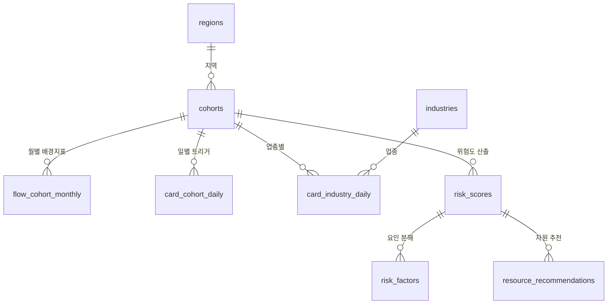
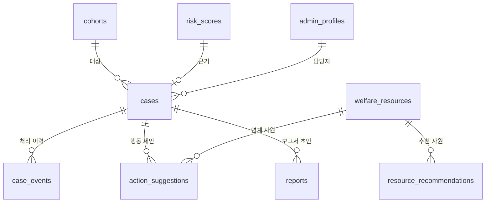
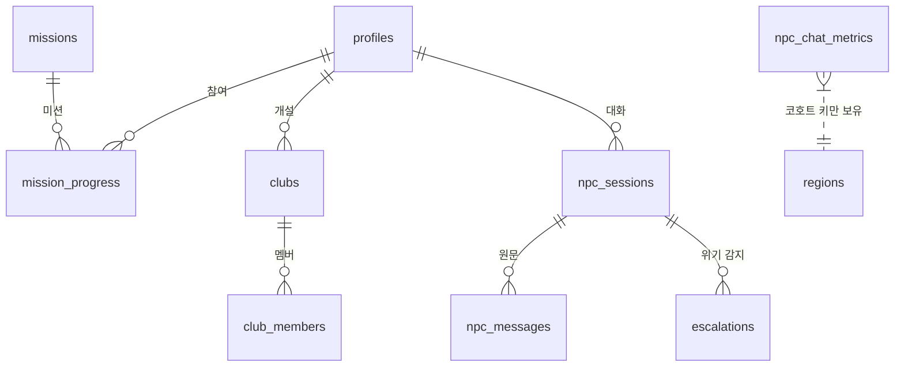

# 사회적 고립 대응 AI 에이전트 — DB 테이블 정의서

> 2026-09-22 작성 · 실행 파일은 `schema.sql`, 설치 절차는 `DB_연결_단계별_실행가이드.md`
>
> **검증 완료** — PostgreSQL 16에서 `schema.sql` 전체를 실제 실행해 오류 없음을 확인했다.
> 생성 결과: **테이블 31개 · 뷰 3개 · RLS 정책 44개 · 인덱스 52개**, 시드 데이터(코호트 24개 포함) 정상 적재.

---

## 1. 설계 원칙

스키마 전체를 관통하는 결정 다섯 가지다. 개별 테이블을 읽기 전에 이것부터 보면 구조가 이해된다.

| # | 원칙 | 구현 방식 |
|---|---|---|
| 1 | **코호트가 1급 객체다** | `cohorts` 테이블을 따로 두고 거시 데이터·위험도·케이스가 모두 `cohort_id`로 연결된다. 개인 단위 테이블과 물리적으로 분리된다 |
| 2 | **위험 탐지에는 개인정보가 도달하지 않는다** | 모듈 7(미시 집계) 테이블에는 `user_id` 컬럼이 **아예 없다**. 대화 원문(`npc_messages`)과 집계 지표(`npc_chat_metrics`) 사이에 외래키가 없어 구조적으로 역추적이 불가능하다 |
| 3 | **판단 근거를 재현할 수 있어야 한다** | `risk_scores`에 입력 지표 4종(`baseline_z`, `trigger_z`, `event_response`, `micro_signal`)과 `model_version`을 함께 저장한다. 점수만 남기지 않는다 |
| 4 | **임계값은 코드가 아니라 데이터다** | 가중치·임계값을 `threshold_settings`에 두어 배포 없이 조정하고, 변경 이력은 `audit_logs`에 남긴다 |
| 5 | **권한은 DB가 강제한다** | 31개 테이블 전부 RLS를 켰다. 프론트엔드 코드를 우회해도 남의 데이터를 읽을 수 없다 |

---

## 2. 모듈 구성

| 모듈 | 테이블 수 | 내용 | MVP 필요 |
|---|---:|---|---|
| 1. 기준정보 | 3 | regions, cohorts, industries | **필수** |
| 2. 거시 분석 데이터 | 5 | 통신·카드 파이프라인 산출물 적재 | 대시보드 구현 시 |
| 3. 위험도 | 2 | risk_scores, risk_factors | 대시보드 구현 시 |
| 4. 복지자원·케이스 | 6 | 자원 매칭부터 보고서 초안까지 | 대시보드 구현 시 |
| 5. 시스템 | 4 | 권한·알림·설정·감사 | 대시보드 구현 시 |
| 6. 소셜 월드 | 8 | 프로필·미션·동아리·NPC 대화 | **필수** |
| 7. 미시 신호 집계 | 3 | 개인 식별자 없는 코호트 단위 지표 | **필수** |

소셜 월드 프로토타입만 먼저 띄운다면 **모듈 1·6·7 (14개 테이블)** 만 실행해도 동작한다.

---

## 3. ERD

### 3-1. 코호트 중심 — 거시 데이터와 위험도



### 3-2. 운영 — 케이스와 산출물



### 3-3. 소셜 월드 — 개인 데이터와 익명 집계의 분리



마지막 줄의 점선이 핵심이다. `npc_chat_metrics`는 `npc_messages`나 `profiles`와 **외래키로 연결되지 않는다.**
지역·연령대·성별이라는 코호트 키만 들고 있어서, 집계된 지표에서 개인을 되짚을 수 없다.

---

## 4. 주요 테이블 정의

### 4-1. `cohorts` — 분석의 기본 단위

| 컬럼 | 타입 | 제약 | 설명 |
|---|---|---|---|
| id | bigint | PK | 코호트 식별자 |
| sgg_code | text | FK → regions | 지역 (11680 강남구 / 51110 춘천시) |
| gender | text | M, F | 성별 |
| age_group | text | 10대~60대이상 | 10세 단위 연령대 |

대상 지역 2곳 × 성별 2 × 연령대 6 = **24개 코호트**가 시드 데이터로 자동 생성된다.
통신 데이터를 6구간으로 맞춰야 카드 데이터와 결합되는 제약(데이터 지표 설계 노트 1장)을 그대로 반영한 수치다.

### 4-2. `risk_scores` — 위험도 산출 결과

| 컬럼 | 타입 | 설명 |
|---|---|---|
| cohort_id, scored_on | — | 복합 유니크. 코호트당 하루 1건 |
| score | numeric(5,2) | 0~100 종합 점수 |
| risk_level | smallint | 1=안심 2=관찰 3=주의 4=경계 5=위험 |
| prev_risk_level | smallint | 직전 단계 (대시보드의 전주 대비 변화 표시용) |
| baseline_z | numeric(6,3) | 거시 — 통신 배경지표 |
| trigger_z | numeric(6,3) | 거시 — 카드 트리거 |
| event_response | numeric(6,3) | 거시 — 이벤트 반응도 |
| micro_signal | numeric(6,3) | 미시 — 소셜월드 신호. **표본 부족 시 null** |
| model_version | text | 산출 로직 버전 |

`micro_signal`이 null을 허용하는 것이 의도된 설계다. 소셜 월드 사용자가 적은 코호트는 거시 신호만으로 위험도를 내고, 그 사실이 데이터에 남는다.

### 4-3. `cases` — 담당자 개입 단위

상태 전이는 기능 정의서 3-6절과 동일하다.

```
received(접수) → reviewing(검토중) → in_progress(진행중) → completed(완료)
                        ↓                    ↓
                   on_hold(보류)        closed(종결)
```

`closed`로 갈 때는 `close_reason`(risk_resolved / not_target / unreachable)을 반드시 남긴다.
`updated_at`은 트리거로 자동 갱신되므로 애플리케이션에서 신경 쓰지 않아도 된다.

### 4-4. `profiles` — 소셜 월드 사용자

| 컬럼 | 설명 |
|---|---|
| id | `auth.users(id)`와 동일한 값. 카카오 로그인으로 발급된 계정 식별자 |
| nickname | 표시 닉네임 |
| sgg_code | **거주 시군구 — 코호트 매핑의 필수 항목** |
| age_group, gender | 온보딩 설문 값. 코호트 키의 나머지 두 축 |
| onboarded_at | null이면 온보딩 미완료 → SW-02로 분기하는 판단 기준 |

`sgg_code`·`age_group`·`gender` 세 칸이 있어야 소셜 월드 활동이 위험도 산출에 반영된다.
온보딩 설문을 건너뛸 수 없게 만든 이유가 여기에 있다.

### 4-5. `npc_chat_metrics` — 개인정보가 없는 표

| 컬럼 | 설명 |
|---|---|
| measured_on | 집계 일자 |
| sgg_code, age_group, gender | 코호트 키 (성별 미상은 'U') |
| npc_type | policy / job / psych / civil |
| session_count | 세션 수 — k-익명성 판정에 사용 |
| risk_keyword_count | 위험 키워드 빈출도 |
| severity_score | LLM 심각도 판정 평균 |

**이 표에 `user_id`가 없다는 것이 설계의 핵심**이다.
백엔드가 대화를 지표로 변환해 여기 적재하고, 위험 탐지 에이전트는 이 표만 읽는다.

---

## 5. 개인정보가 어디에 있는가

제출 서류에 그대로 쓸 수 있도록 정리했다.

| 구분 | 테이블 | 개인 식별 가능성 | 접근 권한 |
|---|---|---|---|
| 개인 데이터 | profiles, mission_progress, clubs, club_members, npc_sessions | 있음 | **본인만** (RLS) |
| 대화 원문 | npc_messages | 있음 | **본인만** (RLS). 보관 기간 정책 확정 필요 |
| 위기 기록 | escalations | 있을 수 있음 | 클라이언트 접근 차단, 백엔드 전용 |
| 익명 집계 | npc_chat_metrics, npc_activity_metrics, engagement_metrics | **없음** | 클라이언트 차단. 대시보드는 k-익명성 뷰로만 조회 |
| 거시 데이터 | flow_cohort_monthly, card_cohort_daily, card_industry_daily | **없음** (원본부터 비식별 집계) | 담당자 조회 |
| 운영 데이터 | cases, reports, action_suggestions | 코호트 단위 | 담당자만 |

**대시보드 담당자는 개인 데이터 테이블에 접근 권한이 없다.** 공무원이 특정 개인의 상담 내용을 열람하는 경로가 구조적으로 존재하지 않는다.

---

## 6. RLS 정책 요약

44개 정책의 원칙은 셋뿐이다.

| 대상 | 규칙 | 예 |
|---|---|---|
| 소셜 월드 개인 데이터 | `auth.uid() = user_id` — 본인 행만 | profiles, mission_progress, npc_sessions |
| 관제 대시보드 데이터 | `public.is_admin()` — admin_profiles에 등록된 계정만 | risk_scores, cases, reports |
| 미시 집계·위기 기록 | **정책 없음** = 클라이언트 전면 차단, service_role(백엔드)만 접근 | npc_chat_metrics, escalations |

`is_admin()`은 `admin_profiles`에 행이 있는지 확인하는 함수다. 담당자 계정 발급은 이 테이블에 행을 추가하는 것으로 이뤄진다.

---

## 7. 뷰 3종

| 뷰 | 용도 | 사용 화면 |
|---|---|---|
| `v_cohort_latest_risk` | 코호트별 최신 위험도 1건 | S-02 대시보드, S-03 지도 |
| `v_priority_targets` | Lv.3 이상 + 진행중 케이스 여부 | S-02 우선지원 대상 Top 10 |
| `v_npc_metrics_public` | 세션 5건 이상 코호트만 노출 (k-익명성) | S-04 미시 신호 카드 |

세 뷰 모두 `security_invoker = on`으로 만들어, 뷰를 통해도 RLS가 우회되지 않는다.

---

## 8. 데이터 흐름

```
[전처리 파이프라인]                      [DB]                        [화면]
preprocessing/clean/*.csv  ──적재──►  flow_cohort_monthly
                                      card_cohort_daily     ──┐
                                      card_industry_daily     │
                                                              ├──► risk_scores ──► S-02 대시보드
[소셜 월드 백엔드]                                            │    risk_factors     S-03 지도
NPC 대화 ──익명화──►  npc_chat_metrics  ────────────────────┘                     S-04 코호트 상세
                      npc_activity_metrics                                         S-05 원인 분석
                      engagement_metrics                                                 │
                                                                                         ▼
                                      welfare_resources ──► resource_recommendations ──► S-06 자원 연계
                                                                    │
                                                                    ▼
                                      cases ──► action_suggestions ──► reports ──► S-12, S-13
                                        │
                                        └──► case_events (처리 이력)
```

기존 전처리 산출물(`preprocessing/clean/`의 10개 파일)이 모듈 2 테이블로 그대로 들어간다.
CSV 적재는 Supabase Table Editor의 Import CSV 기능이나 `copy` 명령으로 처리하면 된다.

---

## 9. 실행 순서

1. `schema.sql` 전체를 Supabase SQL Editor에 붙여넣고 Run
2. Table Editor에서 **테이블 31개 · 뷰 3개**가 보이는지 확인
3. `select * from cohorts;` 로 24개 코호트가 생성됐는지 확인
4. 담당자 계정 등록 (카카오/이메일로 가입 후, 그 계정의 uuid를 `admin_profiles`에 insert)
   ```sql
   insert into public.admin_profiles (id, name, department, role, sgg_code)
   values ('여기에-auth-users-의-uuid', '김민지', '복지정책과', 'manager', '11680');
   ```
5. 전처리 산출물 CSV를 모듈 2 테이블로 적재
6. 소셜 월드 프론트엔드 연결 (`DB_연결_단계별_실행가이드.md` 7장)

---

## 10. 팀이 정해야 할 것 (Open Items)

- [ ] **대화 원문 보관 기간** — `npc_messages`를 며칠 보관하고 언제 삭제할지. 삭제 배치 필요
- [ ] **`escalations.user_id` 보관 여부** — 위기 대응에는 식별자가 필요할 수 있으나, "AI가 개인에게 직접 개입하지 않는다"는 기획 원칙(서비스 기획서 9-4)과 충돌한다. 법률·윤리 검토 필요
- [ ] **k-익명성 기준값** — 현재 `v_npc_metrics_public`에 5로 하드코딩. `threshold_settings.k_anonymity_min`을 참조하도록 바꿀지 결정
- [ ] **업종 코드 체계** — `industries`에 고정지출 5종만 시드로 넣어 두었다. 나머지 85종의 코드·상위 카테고리 매핑 확정 필요 (데이터 분석근거 정리 8장 미해결 항목)
- [ ] **격자 단위 지원 여부** — 현재 지역 단위는 시군구다. 통신 격자(BLOCK_CD) 분석을 하려면 `regions` 아래 격자 테이블이 추가로 필요
- [ ] **case_no 채번 규칙** — 현재 애플리케이션이 생성하도록 두었다. DB 시퀀스로 옮길지 결정

---

## 부록. 테이블 전체 목록

| 모듈 | 테이블 | 용도 |
|---|---|---|
| 1 | regions | 지역 기준정보 |
| 1 | cohorts | 지역×성별×연령대 코호트 |
| 1 | industries | 카드 업종 마스터 (고정지출 플래그) |
| 2 | flow_cohort_monthly | 통신 유동인구 월별 |
| 2 | card_cohort_daily | 카드 결제 일별 |
| 2 | card_industry_daily | 카드 업종별 일별 |
| 2 | event_periods | 명절·공휴일 등 이벤트 구간 |
| 2 | date_splits | baseline/event/eval 3분할 라벨 |
| 3 | risk_scores | 5단계 위험도 산출 결과 |
| 3 | risk_factors | 위험 요인 기여도 분해 |
| 4 | welfare_resources | 복지자원 목록 |
| 4 | resource_recommendations | 자원 추천 결과 |
| 4 | cases | 케이스 |
| 4 | case_events | 케이스 처리 이력 |
| 4 | action_suggestions | 공무원 행동 제안 |
| 4 | reports | 보고서·제안서 초안 |
| 5 | admin_profiles | 담당자 계정·권한 |
| 5 | notifications | 알림 |
| 5 | threshold_settings | 임계값·가중치 |
| 5 | audit_logs | 감사 로그 |
| 6 | profiles | 소셜월드 사용자 프로필 |
| 6 | missions | 미션 |
| 6 | mission_progress | 미션 진행상태 |
| 6 | clubs | 동아리 |
| 6 | club_members | 동아리 멤버 |
| 6 | npc_sessions | NPC 대화 세션 |
| 6 | npc_messages | NPC 대화 원문 |
| 6 | escalations | 위기 에스컬레이션 기록 |
| 7 | npc_chat_metrics | 심리 신호 코호트 집계 |
| 7 | npc_activity_metrics | 정책·취업·민원 수요 집계 |
| 7 | engagement_metrics | 게임 활동성 집계 |
