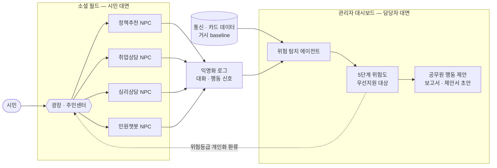
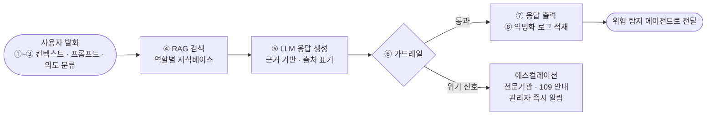
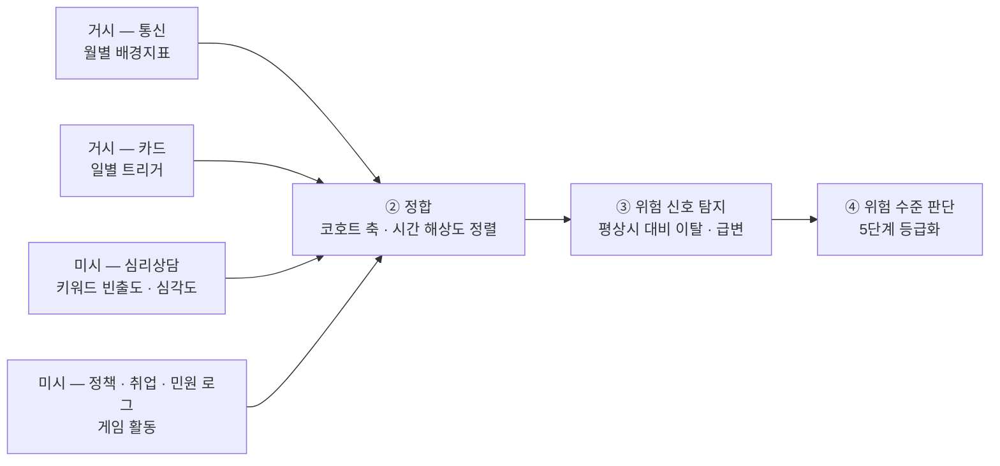
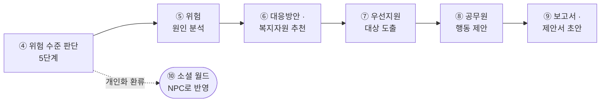

# 사회적 고립 대응 AI 에이전트 — 통합 기획서

> 2026-09-22 기준 · 제14회 2026 빅콘테스트 AI데이터활용 분야 「사회적 고립 예방 및 대응을 위한 AI 에이전트 개발」 참가를 위한 **팀 내부 전략·설계 통합 문서**. 기존 「기획서」와 「소셜 월드 기획 및 NPC 파이프라인 설계」를 하나로 합침.
>
> 읽는 법 — 1~5장: 전략·데이터 / 6~9장: 구현 설계 / 10장: 심사 대응 / 11장: 남은 결정. 개발 담당은 6장부터 보면 됨.

## 1. 개요

통신·카드 데이터를 기반으로 지역×인구집단 단위의 고립 위험을 조기에 탐지하고, AI 에이전트가 위험 수준을 판단해 공공·복지 자원을 추천·연계하는 **탐지·개입 트랙**과, 시민(특히 고립 위험 청년) 대상 **예방형 게임 웹서비스 트랙(소셜 월드)**을 함께 설계한다.

두 트랙은 데이터로 연결된다. 소셜 월드에서 수집되는 대화·행동 데이터가 위험 지수의 새로운 입력이 되고, 위험 수준 판단 결과가 게임 내 콘텐츠 개인화에 반영된다. 소셜 월드는 목업이 아니라 **실제 작동하는 프로토타입 웹앱**으로 구현해 대회 필수요소인 "대응 프로세스 및 활용 시나리오"를 실물로 증명한다.

## 2. 배경 및 문제 정의

1인 가구 증가와 관계망 약화로 고독사·은둔형 외톨이 문제가 심화되고 있지만, 기존 복지체계는 사후 대응 중심이라 위기 징후를 조기에 포착하지 못한다. 대회는 통신·카드 데이터를 결합해 지역 및 인구집단 단위의 고립 위험도를 5단계로 실시간 지수화하고, 위험 수준에 따라 개입 단계를 결정하는 AI 에이전트 모델을 요구한다.

**대상 지역**: 서울시 강남구, 강원도 춘천시 (데이터 제공사: SK텔레콤, 신한카드)

- **강남구**: SK텔레콤·강남구청의 "독거어르신 ICT돌봄서비스(NUGU)" 운영 이력(AI 돌봄기기 1,240대까지 확대), SKT 본사 소재지
- **춘천시**: 국토부 "스마트시티 챌린지" 예비사업지 선정 이력(2019·2021)
- 당초 "강남=청년형 고립 / 춘천=고령형 고립" 대비 가설을 세웠으나, 춘천시 청년(20~30대) 1인가구 비율이 강원도 내 최고치(45.4%)로 나타나 고령 독거와 청년 자취가 공존하는 이중구조일 가능성이 높음 — KOSIS/행안부 데이터로 검증 필요(Open Item)

## 3. 제공 데이터 현황 및 핵심 제약

대회 측 실제 테이블 정의서(별첨1/별첨2) 확인 결과, 주제설명자료 요약과 다른 세부 제약이 있어 아래로 확정한다.

| 구분 | 통신(유동인구) | 카드(결제, 사회적 고립 트랙 스키마) |
|---|---|---|
| 집계 단위 | 월별 스냅샷(일평균값), 3개 테이블로 축 분리(연령성별 / 시간대 / 요일) | 일별(TA_YMD, 184일치) |
| 공간 단위 | 격자(BLOCK_CD+UTM-K 좌표), 시군구명 없음 | 시군구(MCT_SGG_CD) |
| 결합 가능 축 | 연령대×성별은 가능, 시간대·요일과는 조합 불가 | 연령대·성별·거주지(CLN_SGG_CD, 시도 단위) |
| 채널 | — | 오프라인 결제 한정, 법인카드 제외 |
| 핵심 제약 | 월 6개 시점뿐 → 일별 이상탐지 부적합 | 시간대 축 없음(사회적 고립 트랙 스키마 기준) |

- 격자↔행정구역 매핑 테이블 제공 여부는 미확인(Open Item)
- 세밀한 시계열 분석은 카드 데이터가 중심, 낮/밤 패턴 분석은 통신 데이터로만 가능(연령·성별과 조합 불가)

## 4. 데이터 활용 전략

### 4-1. 계층적 활용 — 통신=배경지표, 카드=트리거

통신·카드 데이터의 시간 해상도 차이(월별 vs 일별)를 계층적으로 활용한다.

- **통신 데이터** → 코호트(지역×연령대×성별)의 "평상시 활동 프로필"을 정의하는 **월간 배경지표(baseline)**
- **카드 데이터** → 일별 결제 이탈을 감지하는 **트리거 신호(trigger)**. 거주자(CLN_SGG_CD) vs 외지인 소비 구분에도 활용

### 4-2. 거시·미시 2층 구조

대회 데이터셋(통신·카드)만으로는 심리상담 NPC 같은 대화 기반 신호를 만들 수 없고, 그럴 필요도 없다. 두 데이터가 서로 다른 층위를 담당하기 때문이다.

| 층위 | 데이터 | 분석 단위 | 역할 |
|---|---|---|---|
| 거시(Macro) | 대회 제공 통신·카드 데이터 | 지역 × 연령대 × 성별 코호트 (집계·비식별) | "어느 지역·어느 집단이 위험한가" — 베이스라인 위험도 |
| 미시(Micro) | 소셜 월드 NPC 대화·행동 로그 (익명화) | 개인 대화 → 지역 단위 익명 집계 | "왜 위험한가 / 무엇이 필요한가" — 원인·수요 신호 + 개입 채널 |

- 대회 데이터에는 **텍스트도 없고 개인 단위도 없다**(비식별 집계). 따라서 대화·키워드 분석은 대회 데이터에서 파생될 수 없고 **독립적인 신호원**으로 설계해야 한다
- 반대로 거시 층은 미시 층이 커버할 수 없는 것(서비스 미가입자, 지역 전체 분포)을 커버한다 → **두 층이 상호보완**
- 이 구조는 평가항목 "데이터 지속 활용성(10점)"에 정확히 대응한다: 서비스가 돌아갈수록 미시 데이터가 쌓여 탐지 모델이 개선되는 선순환

### 4-3. 외부 공공데이터 보강 및 검증 라벨

무료·공개 데이터에 한해 보강한다.

- 인구·가구구조: 1인가구 비율, 65세 이상 비율, 순이동(전입-전출)
- 복지 행정데이터: 기초생활수급자·차상위 비율, 노인맞춤돌봄서비스 대상자 수
- 주거환경: 소형주거(원룸·오피스텔·고시원)·반지하·노후주택 비율
- 의료·이동성: 병의원 접근성, 대중교통 승하차
- **검증용 라벨**: KOSIS 고독사 발생현황(지역별)로 지수 타당성 사후 검증

### 4-4. 페르소나 기반 가상데이터

프로토타입 단계에는 실제 유저·실제 채팅 로그가 없으므로, 미시 층 파이프라인(6-4)을 증명하려면 가상 채팅 데이터가 필요하다. **대회 규칙이 이를 명시적으로 허용한다.**

> "제공된 데이터셋 기반으로 추가적인 데이터 부가하거나, **페르소나 기반의 가상 데이터(synthetic data)를 생성하여 활용 가능** ※ 단, 데이터 부가 시 부가된 데이터의 항목, 가상데이터 생성 시 **생성 방식에 대한 설명자료 제출 필수**" (주제설명자료 260907)

- 권장 흐름: 대회 데이터로 도출한 코호트(예: 강남구 20대 여성 / 춘천 60대 이상 남성)에서 **페르소나 파생** → 페르소나별 가상 채팅 로그 생성 → 6-4 파이프라인 투입 → 지역별 위험도 산출 시연
- 페르소나의 출발점이 대회 데이터이므로 **데이터 근거의 체인이 끊기지 않는다**
- 가상데이터 생성 방식 설명자료는 **제출 필수 항목** → 별도 산출물로 WBS에 반영 필요

## 5. 고립 위험 지수 설계

**분석 단위**: 개인 트래킹은 데이터 구조상 불가 — "지역×연령대×성별" 코호트를 기본 단위로 한다(예: 강남구·20대·여성).

**방법론 후보**

1. **정규화(z-score/min-max) + 도메인 가중합** — 해석이 쉽고 심사 발표에 유리
2. **지도학습 스코어링(XGBoost 등)** — 고독사 통계 등을 라벨로 사용, 단 라벨 희소성이 한계
3. **비지도 이상탐지(Isolation Forest 등)** — "평소 대비 이탈도"를 스코어화, 카드 데이터(일별) 중심 적용이 현실적

**5단계 지수화**: 최종 스코어를 분위수(quintile) 기준으로 구간화.

**확정 필요**: 4-1의 계층적 설계(통신=배경지표 / 카드=트리거)를 지수 산출에 어떻게 구체화할지(Open Item).

### 5-1. 프로토타입 단계의 구현 수준과 표현 주의

- **"학습"이라는 표현에 주의**: 실제 학습 데이터가 없는 상태에서 "학습한다"고 쓰면 심사에서 "무엇으로 학습했나"라는 질문을 받는다. 프로토타입 단계는 (1) 근거 있는 **위험 키워드 사전 + 스코어링 규칙**, (2) LLM 기반 분류/심각도 판정 조합이 현실적이다. "향후 실데이터 축적 시 지도학습으로 고도화"는 로드맵으로 제시한다
- **거시·미시 결합 가중치**: 프로토타입 단계의 미시 데이터는 가상데이터이므로, **거시를 주(主)로 두고 미시를 보정 신호로 얹는 구조**가 방어하기 쉽다
- **키워드 사전의 근거**: 임의 키워드셋은 감점 요인. 공개 자료(UCLA Loneliness Scale, De Jong Gierveld Scale, 서울시 고립은둔청년 실태조사 등)에서 문항·지표를 근거로 끌어온다

## 6. AI 에이전트 설계

에이전트는 두 갈래다. 시민이 소셜 월드에서 직접 대화하는 **NPC 에이전트 4종**과, 지자체 담당자가 쓰는 관리자 대시보드의 **위험 탐지 에이전트**다. 앞의 에이전트가 만든 대화·행동 신호가 뒤로 흘러가고, 뒤에서 판단한 위험 등급이 다시 앞의 개인화에 반영된다.

*그림 1. 전체 구조 — 시민 대면 트랙과 관리자 대면 트랙의 연결*

### 6-1. 공통 파이프라인 (NPC 4종 공통)

정책추천·취업상담·심리상담·민원챗봇은 모두 아래 골격을 공유하고, 역할별로 **시스템 프롬프트 / 지식베이스 / 출력 포맷 / 로그 스키마 / 가드레일 강도**만 달라진다. 4종을 각각 별도 시스템으로 만들지 않고 하나의 에이전트 런타임 위에 역할을 얹는 구조를 권장한다.

*그림 2. NPC 공통 파이프라인 — ① 컨텍스트 로딩(프로필·대화이력·위험등급) → ② 역할별 시스템 프롬프트 주입 → ③ 의도 분류 → ④ RAG 검색 → ⑤ 응답 생성 → ⑥ 가드레일 → ⑦ 응답 출력 → ⑧ 익명화 로그 적재*

**공통 원칙**

- 정책·공고·혜택처럼 사실관계가 중요한 응답은 **반드시 검색된 문서에 근거**하고 출처를 함께 표시한다(환각 시 실제 피해가 발생하는 영역)
- ⑧ 로그는 **개인 식별정보를 제거한 뒤** 적재한다. 지역 단위 집계 시 최소 표본 수 기준을 적용한다(8-2 참고)
- ⑥ 위기신호 감지는 심리상담 NPC뿐 아니라 **모든 NPC에 공통 적용**한다 — 취업상담 중에도 위기 발화가 나올 수 있다

### 6-2. 정책추천 NPC (광장)

**목적**: 사용자 상황에 맞는 정책·복지 혜택을 먼저 찾아서 제안

| 단계 | 처리 |
|---|---|
| ① 입력 | 프로필(연령대·성별·거주 시군구·온보딩 설문) + 대화 내용 + 위험 탐지 에이전트가 내려준 위험도 등급 |
| ② 상황 추출 | LLM이 대화에서 니즈를 구조화 (주거비 부담 / 실직 / 사회적 단절 / 건강 문제 등) |
| ③ 정책 검색(RAG) | 정책 지식베이스에서 후보 retrieve — 중앙부처 + 거주 지자체(강남구·춘천시) |
| ④ 자격 필터링 | 연령·거주지·소득·가구형태 등 자격요건 1차 필터 (자격 미달 정책 추천은 신뢰 훼손) |
| ⑤ 랭킹 | 상황 적합도 + 위험도 등급 + 신청 난이도로 정렬 |
| ⑥ 출력 | 정책 카드(정책명 / 지원 내용 / 자격요건 / 신청방법 / 출처) + **추천 이유 문장** |
| ⑦ 핸드오프 | 신청 의사를 보이면 → 주민센터 민원챗봇으로 연결 |
| ⑧ 로그 | 조회 정책, 추천 근거(매칭 조건), **신청까지 이어진 정책** → 대시보드 |

**지식베이스 후보** ※ 실제 API 제공 형태·갱신 주기 확인 필요: 복지로(중앙부처·지자체 복지서비스), 온통청년(청년정책), 강남구·춘천시 자체 지원사업 목록

**산출 신호**: 정책 카테고리별 조회 빈도, 추천→신청 전환율, **자격 미달로 걸러진 수요**(= 제도 사각지대의 직접 근거)

### 6-3. 취업상담 NPC (광장)

**목적**: 희망 직무·관심사 기반 취업지원 프로그램·공고 안내 + 이력서·포트폴리오 작성 가이드

| 단계 | 처리 |
|---|---|
| ① 입력 | 프로필 + 대화(희망 직무, 관심 분야, 현재 상태: 구직중/휴학/경력단절/장기 미취업) |
| ② 프로파일 구성 | 희망직무 · 관심분야 · 준비 수준(초기 탐색 / 서류 준비 / 지원 중) 추출 |
| ③ 분기 | (a) 프로그램·공고 안내 / (b) 서류 작성 가이드 |
| ④-a 검색(RAG) | 취업지원 프로그램 + 채용공고 retrieve → 조건 매칭 후 카드 제시 |
| ④-b 작성 코칭 | 가이드 문서 기반 단계별 코칭(항목 구조 → 문장 다듬기 순) |
| ⑤ 출력 | 프로그램/공고 카드 또는 작성 가이드 + 다음 액션 1개 제안 |
| ⑥ 미션방 연계 | "이번 주 자기소개서 1문항 작성" 같은 **실행 미션으로 전환** → 미션방 등록 |
| ⑦ 로그 | 요청된 직무·분야 분포, 준비 단계 분포, 자주 막히는 지점 → 대시보드 |

**지식베이스 후보** ※ 확인 필요: 워크넷 등 채용정보 공공데이터, 국민취업지원제도·청년도전지원사업 등 취업지원 프로그램 정보, 이력서·포트폴리오 작성 가이드(자체 큐레이션)

**산출 신호**: 지역·계층별로 필요로 하는 취업 정보 유형(직무·분야·준비단계별 수요 분포)

**설계 메모**: 취업 실패 경험은 청년 고립의 주요 트리거(10-1의 발생 계기 축). 좌절·자책 발화가 감지되면 심리상담 NPC로 자연스럽게 넘기는 경로를 둔다.

### 6-4. 심리상담 NPC (광장)

**기초 뼈대**

1. 유저와 대화를 한다.
2. 대화를 기반으로 유저가 어떤 상황인지, 고립감·우울감은 어느 정도인지 파악한다. 위험도를 판별하는 **키워드를 중심으로 빈출도와 심각성 정도**를 측정한다.
3. 위험 탐지 에이전트가 이 데이터(**익명화된 채팅 내역** 기반 위험 키워드 빈출도·심각도)를 활용해 **해당 지역의 고립 위험도를 탐지**한다.

**상세 파이프라인**

| 단계 | 처리 |
|---|---|
| ① 대화 | 상담 톤 가이드라인에 따라 응답(진단·단정 금지, 경청 중심) |
| ② 신호 추출 | **위험 키워드 사전** 매칭 → 키워드별 빈출도 집계 + LLM 기반 **심각도 판정**(맥락 고려: 관용어인지 실제 위기인지 구분) |
| ③ 위기 분기 | 고위험 신호 감지 시 즉시 에스컬레이션 (8-1) |
| ④ 사용자 대응 | 정서적 지지 응답 + 상황에 맞는 다음 공간 유도(동아리방 / 미션방 / 정책추천 NPC) |
| ⑤ 익명화 | 개인 식별정보 제거, 원문이 아닌 **지표 형태**(키워드 빈출도·심각도 점수)로 변환 |
| ⑥ 집계 | 지역(시군구) × 연령대 × 성별 코호트 단위 집계 — 최소 표본 수 미달 코호트는 미노출 |
| ⑦ 전달 | 위험 탐지 에이전트로 전달 → 지역 고립 위험도 탐지에 반영 |

**지식베이스 / 참조 자원** ※ 확정 필요: 위험 키워드 사전(UCLA Loneliness Scale, De Jong Gierveld Scale, 서울시 고립은둔청년 실태조사 문항 기반), 상담 응답 톤·금기 가이드라인, 위기대응 프로토콜 및 연계 기관 목록

**산출 신호**: 위험 키워드 빈출도, 우울·고립감 정도, 코호트별 추이 — 미시 층의 핵심 신호

### 6-5. 민원챗봇 NPC (주민센터)

**목적**: 지역·중앙부처 복지/혜택을 한눈에 검색 + 민원 접수

| 단계 | 처리 |
|---|---|
| ① 입력 | 사용자 질의 + 프로필(거주 시군구·연령대) |
| ② 질의 분류 | (a) 정보 조회형 / (b) 민원 접수형 |
| ③-a 통합 검색(RAG) | 지역 + 중앙부처 복지/혜택을 한 번에 검색해 **비교 가능한 형태**로 정리(지원내용 / 자격 / 신청처 / 마감) |
| ③-b 민원 접수 | 민원 유형 분류 → 대화형으로 필요 항목 수집 → 접수 처리 → **접수번호 발급 및 진행상태 안내** |
| ④ 출력 | 혜택 비교표 또는 접수 확인서 |
| ⑤ 로그 | 민원 유형 분포, 조회 많은 혜택, 조회→접수 전환율 → 대시보드 |

**미확정**: ③-b의 "접수"가 실제 기관 시스템 연동인지 시연용 시뮬레이션인지 — 프로토타입 일정상 **시뮬레이션 + 실제 신청 경로 안내** 조합이 현실적

**산출 신호**: **지역별 민원 유형 분포** — 해당 지역이 겪는 문제의 가장 직접적인 증거로 활용한다(기존 "연계 방안 미정"에서 확정)

### 6-6. 관리자 위험 탐지 에이전트

**목적**: 거시(통신·카드) + 미시(NPC 대화·행동) 신호를 통합해 지역·인구집단 단위 고립 위험도를 산출하고, 담당 공무원이 바로 쓸 수 있는 산출물까지 만든다.

대회 주제설명자료의 운영 흐름("위험 신호 탐지 → 위험 수준 판단 → 위험 원인 분석 → 대응 방안·복지자원 추천 → 우선 지원 대상 지역·계층 도출")을 그대로 따르되, **⑧·⑨ 단계를 확장**한 것이 우리 설계의 차별점이다.

*그림 3. 위험 탐지 에이전트 — ① 수집과 ②~④ 정합·탐지·판단*

*그림 4. 위험 탐지 에이전트 — ⑤~⑨ 대응·산출과 ⑩ 환류 (노란색 ⑧·⑨가 대회 운영흐름 대비 확장 단계)*

| 단계 | 처리 | 대회 운영흐름 |
|---|---|---|
| ① 수집 | 3개 신호원 통합 · 거시: 통신(월별 배경지표) + 카드(일별 트리거) · 미시-심리: 심리상담 NPC 키워드 지표 · 미시-행동: 정책추천·취업상담·민원챗봇 로그 + 게임 활동(로그인 빈도, 미션 참여, 동아리 활동) | — |
| ② 정합 | 코호트 축 정렬(지역×연령대×성별) + 시간 해상도 정렬(통신 월별 / 카드 일별 / 게임 실시간) | — |
| ③ 탐지 | 코호트별 평상시 대비 이탈·급변 탐지 | 위험 신호 탐지 |
| ④ 판단 | 통합 스코어 산출 → **5단계 등급화** | 위험 수준 판단 |
| ⑤ 원인 분석 | 어떤 신호가 위험도를 끌어올렸는지 기여도 분해(설명가능성) | 위험 원인 분석 |
| ⑥ 추천 | 등급별 개입 방안 + 복지자원 매칭 | 대응 방안·복지자원 추천 |
| ⑦ 우선순위 | 지원이 시급한 지역·계층 리스트 도출 | 우선 지원 대상 도출 |
| ⑧ 행동 제안 | 담당 공무원에게 **구체적 행동**을 제안(누구를, 어떤 순서로, 어떤 자원과) | **확장** |
| ⑨ 문서 초안 | ⑧을 바탕으로 **보고서·제안서 초안 작성** | **확장** |
| ⑩ 환류 | 산출 결과를 소셜 월드 NPC로 되돌려 개인화 추천에 반영 | **선순환** |

**LLM 활용 지점**: 위험 신호 해석(코호트별 이탈 패턴 설명), 대응 방안 생성, 맞춤형 복지서비스 추천 문구 생성, ⑨의 문서 초안 작성

**참고 사례**: 서울시 '똑똑안부확인'·'AI 안부든든'(개인 단위 → 코호트 단위로 재해석 필요), 보건복지부 복지 사각지대 발굴시스템(위기정보 44종 결합 스코어링 로직 참고)

**미확정 핵심 항목**: ②의 시간 해상도 불일치 처리 방식, ④의 거시·미시 결합 가중치(5-1 참고), ⑤의 기여도 분해 방식(규칙 기반 vs SHAP 등)

### 6-7. 대시보드 수집 로그 요약

| 출처 | 수집 지표 | 위험 탐지 에이전트에서의 활용 |
|---|---|---|
| 정책추천 NPC | 정책별 조회수, 추천→신청 전환, 자격 미달 수요 | 수요가 높은 정책과 그 근거 파악 + 제도 사각지대 도출 |
| 취업상담 NPC | 직무·분야별 수요, 준비 단계 분포 | 지역·계층별 취업 지원 수요 파악 |
| 심리상담 NPC | 위험 키워드 빈출도, 우울·고립감 정도 | 해당 지역의 고립 위험도 탐지에 반영(핵심 미시 신호) |
| 민원챗봇 NPC | 민원 유형 분포, 혜택 조회 순위 | 지역별 문제 유형의 직접 증거 |
| 게임 전반 | 로그인 빈도, 미션 참여, 동아리·미니게임 활동량 | 사용자 활동성 = 고립도의 행동 프록시 |

## 7. 시민 참여형 예방 게임 서비스 — 소셜 월드

### 7-1. 컨셉 및 공간 구조

"동물의 숲" 스타일 마을 웹게임. **광장**을 중심으로 주변에 5개 공간이 배치되며, 광장에는 사용자와 NPC가 혼재한다. 목적은 고립 위험 청년의 사회적 교류에 대한 **심리적 장벽을 낮추는 것**이다.

| 공간 | 기능 | 상태 |
|---|---|---|
| 광장 | 사용자·NPC가 혼재하는 중심 공간. 정책추천·취업상담·심리상담 NPC 3종 상주 | 확정 |
| 주민센터 | 민원챗봇 NPC 상주 — 복지·혜택 정보 검색 및 민원 접수 | 뼈대 수준 |
| 미션방 | 사용자가 지속적으로 사회 활동을 이어가도록 미션 제공 | 확정 |
| 동아리방 | 사용자끼리 문화·공연·체육 등 동아리를 개설·운영하는 공간 | 확정 |
| 미니게임 | 사용자 간 협동심 함양 및 친교 활동 공간 | 확정(세부 종류 Open) |
| 게시판 | (기능 상세 미정) | Open |

각 NPC의 동작은 6장에 정리했다.

### 7-2. 계정 체계

- **간단한 개인 프로필**(닉네임 + 간단 설문 수준) — 정식 회원가입/인증 없이 개인화 상태만 유지. 시연 목적엔 이 수준이면 충분하고 개발 부담이 적다
- 단, 지역 단위 위험도를 산출하려면 **거주 지역 정보가 반드시 필요**하다 → 온보딩 설문에 지역(시군구) 항목을 포함한다

## 8. 안전·개인정보 설계

고립 위험 청년을 대상으로 심리 대화를 수집하는 서비스인 만큼, 아래는 선택이 아니라 필수다. 평가항목 "실현 가능성 — 정책/제도적 실현 가능성, 운영 현실성(15점)"에도 직결된다.

### 8-1. 위기 상황 에스컬레이션

- 자해·자살 등 고위험 신호 감지 시의 처리 경로를 설계에 포함한다: **전문기관·핫라인 안내 + 관리자 즉시 알림**
- 자살예방 상담전화는 2024년 1월부터 **109로 통합 운영**되고 있다
- 감지 기준, 알림 경로, 안내 문구는 확정 필요(Open Item)
- 이 가드레일은 심리상담 NPC 전용이 아니라 **전 NPC 공통 적용**한다(6-1 ⑥)

### 8-2. 개인정보·익명화

- 심리 상태는 민감정보다. 아래를 정책으로 확정하고 문서화한다
  - 익명화 시점(수집 즉시 vs 저장 후)
  - 원문 대화 보관 여부 및 보관 기간
  - 지역 단위 집계 시 최소 표본 수(k-익명성) 기준값 — 미달 코호트는 대시보드에 미노출
- 위험 탐지 에이전트로 전달되는 것은 원문이 아니라 **지표 형태**(빈출도·심각도 점수)다

### 8-3. 서비스 포지셔닝

심리상담 NPC는 **상담사가 아니라 대화형 스크리닝·연결 도구**로 포지셔닝한다. 진단·치료를 표방하지 않는다는 문구를 UI에 명시한다.

## 9. 기술 스택

- 프론트엔드: **React 기반**(확정)
- 렌더링 방식(2D/2.5D/3D): **보류 — 팀 논의 예정**
  - A. React Three Fiber + 무료 CC0 저폴리곤 에셋팩(Kenney.nl 등) — 실제 3D 느낌, 직접 모델링 없이 구현 가능
  - B. Phaser 아이소메트릭 2.5D — 가장 빠르고 일정 리스크가 가장 적음
  - C. 직접 3D 모델링/애니메이션 — 일정상 비권장
- 백엔드/RAG: NPC 4종 + 위험 탐지 에이전트까지 총 5개 역할별 에이전트. 6-1의 공통 런타임 위에 역할을 얹는 구조를 권장. 역할별 지식베이스(정책 DB, 채용정보, 심리상담 가이드라인, 정부기관 복지·혜택 DB) 분리 여부 결정 필요
- 관리자 대시보드는 별도 화면이므로 **관리자 인증·권한 체계** 필요 여부 결정 필요

## 10. 차별화 포인트 및 기대효과

### 10-1. 고립의 재정의 — 활동량 감소를 넘어

"고립=활동량 감소"라는 통상적 정의를 넘어 재정의 축을 검토한다.

- **자발성 축**: 자발적 은둔 vs 비자발적 고립(사별·실직 등)
- **지속기간 축**: 전환기적·일시적 고립 vs 만성적 고립
- **가시성 축**: 겉으로는 정상 활동하지만 관계 깊이가 없는 "가면 고립" — 활동량 지표의 사각지대를 한계로 명시하면 오히려 신뢰도 상승 요인
- **발생 계기 축**: 취업실패형(청년)·사별형(고령)·은퇴 후 역할상실형(중장년)·질병형 등 트리거별 시그니처

**다음 액션**: 위 축 중 2개를 골라 2x2 매트릭스로 유형화하고, 3장의 데이터 제약 기준으로 실제 구현 가능한 시그니처인지 먼저 필터링한다.

### 10-2. 평가항목 대응

| 평가항목(1차 서류) | 대응 요소 |
|---|---|
| 아이디어 창의성·독창성 (25점) | 탐지에 그치지 않고 예방형 게임을 개입 채널로 설계, 고립 재정의 축(10-1), 위험 탐지 에이전트의 ⑧·⑨ 확장 |
| 데이터 근거 및 분석력 (25점) | 실제 테이블 정의서 기반 제약 확정(3장), 계층적 활용 전략(4-1), 고독사 통계 기반 검증(4-3) |
| 사회적 영향력 (15점) | 사후 대응 → 사전 예방 전환, 심리적 장벽 완화라는 직접적 개입 |
| 실현 가능성 (15점) | 실제 작동하는 프로토타입, 위기 에스컬레이션·개인정보 방침(8장), 공무원 대면 산출물(6-6 ⑧⑨) |
| 데이터 지속 활용성 (10점) | 거시·미시 2층 구조의 선순환(4-2) — 서비스가 돌수록 탐지 모델이 개선됨 |
| 완성도 (10점) | 판단 기준·산출 방식·추천 과정의 재현 가능한 기술 |

### 10-3. 기대효과

사후 대응 중심 복지체계를 사전 예방형으로 전환하고, 지자체 복지 자원의 선제적 배분 근거를 제공하며, 재현 가능한 판단 기준으로 정책 확장성을 확보한다. 예방 게임 서비스는 고립 위험 청년의 심리적 장벽을 낮추는 실행 채널이자, 대화 데이터를 통해 탐지 모델을 지속적으로 보강하는 피드백 루프로 기능한다.

## 11. Open Items

**데이터·지수**

- [ ] KOSIS/행안부 데이터로 강남구·춘천시 연령대별 1인가구 분포 비교(이중구조 가설 검증)
- [ ] 격자(BLOCK_CD/UTM-K) ↔ 행정구역 매핑 테이블 확보 가능 여부 확인
- [ ] 지수 방법론 확정 + 계층적 설계(통신=배경지표 / 카드=트리거) 구체화
- [ ] 거시·미시 신호의 결합 가중치·시점 정렬
- [ ] 페르소나 기반 가상 채팅데이터 생성 방식 설계 + **설명자료(제출 필수 항목)**
- [ ] 고립 재정의 축 2개 선택 → 2x2 매트릭스 확정 및 데이터 시그니처 매핑

**에이전트·서비스**

- [ ] 5개 에이전트를 단일 런타임 + 역할별 프롬프트로 갈지, 역할별 분리 구축할지
- [ ] 각 NPC 지식베이스의 실제 데이터 출처 확정 및 수집 가능 여부(복지로·온통청년·워크넷 등 API 제공 형태)
- [ ] 위험 키워드 사전 확정 + 심각도 스코어링 방식(근거 자료 매핑 포함)
- [ ] NPC 간 핸드오프 규칙(취업상담→심리상담, 정책추천→민원챗봇 등)
- [ ] 민원챗봇의 "민원 접수"가 실제 기관 연동인지 시연용 시뮬레이션인지
- [ ] 미션방·동아리방·미니게임·게시판의 세부 기능
- [ ] 주민센터 구성 최종 확정(현재 민원챗봇 1종 — 뼈대 수준)

**안전·운영**

- [ ] 위기 에스컬레이션 프로토콜 상세(감지 기준, 알림 경로, 안내 문구)
- [ ] 개인정보·익명화 처리 방침(익명화 시점, 원문 보관 여부, k-익명성 기준값)
- [ ] 관리자 대시보드 UI/기능 범위 및 인증 체계

**개발·일정**

- [ ] 렌더링 기술스택 최종 결정(3D vs 2.5D vs 하이브리드)
- [ ] 계정/프로필 데이터 스키마(거주 지역 항목 포함)
- [ ] 게임웹 + 관리자 대시보드 워크스트림 추가에 따른 WBS 재조정 — 기존 WBS(사회적고립_AI_Agent_WBS.xlsx)에 미반영 상태
