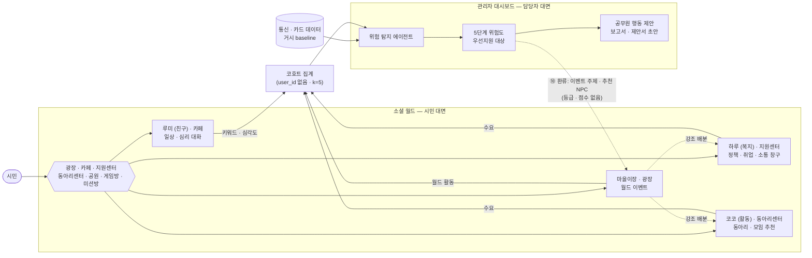
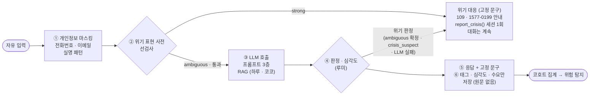
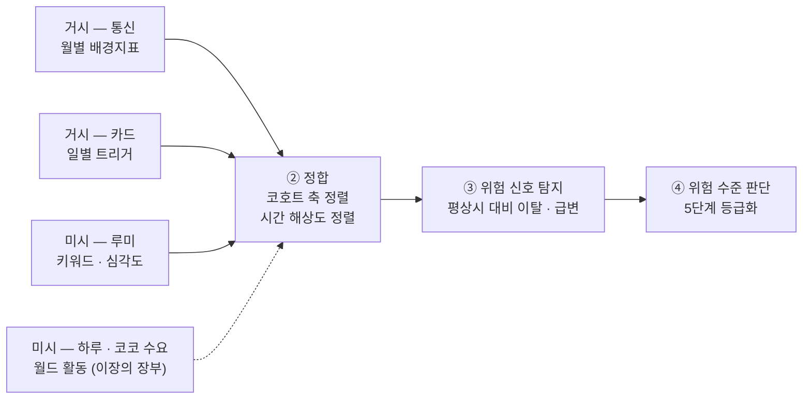
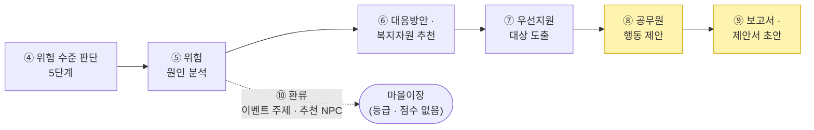

# 사회적 고립 대응 AI 에이전트 — 통합 기획서

> 2026-09-22 작성 · **2026-10-08 갱신** · 제14회 2026 빅콘테스트 AI데이터활용 분야 「사회적 고립 예방 및 대응을 위한 AI 에이전트 개발」 참가를 위한 **팀 내부 전략·설계 통합 문서**. 기존 「기획서」와 「소셜 월드 기획 및 NPC 파이프라인 설계」를 하나로 합침.
>
> 읽는 법 — 1~5장: 전략·데이터 / 6~9장: 구현 설계 / 10장: 심사 대응 / 11장: 남은 결정 / 12장: 구현 현황. 개발 담당은 6장부터 보면 됨.
>
> 이 .md가 원본이다. 상세 설계는 `소셜월드_게임흐름_NPC_설계.md`(NPC·월드), `위험사전_v1_작업계획.md`·`위험사전_근거_매핑표.md`(위험사전), 기능별 상태는 `docs/project_management/구현_현황표.md`.
>
> **변경 이력**
> - 09-22 최초 통합
> - 09-23 12장 구현 현황 추가
> - 09-29 소셜 월드 NPC 캐릭터·공간·퀘스트 단계 결정 반영(6장 머리말, 7장, 11장)
> - **10-06** 6장을 루미·하루·코코·마을이장 기준으로 재작성(옛 정책추천·취업상담·심리상담·민원챗봇 파이프라인은 각 NPC 절에 흡수), 위험사전 2종과 심각도 공식(5-1·6-1·6-2·8-1), 하루의 월드 소통 창구(6-3, 9/30 결정), 코코·마을이장 v1 구현(6-4·6-5), 렌더링 3D 확정(9장, 10/1 결정), 11·12장 갱신
> - **10-08** 하루 v1 구현 반영 — 6-3을 구현(v1)과 다음 단계(v2)로 나눔, 마을 의견함(이장·하루 공동 창구 + 운영팀 화면), 대시보드 "소셜 월드에서 찾은 지원"(6-7·7-1·11·12장)
- **10-08** 위험사전 킥오프 결정 반영 — 위기 3등급(strong/ambiguous/idiom), 위기 뒤 대화 계속, 심각도 구간 0.45/0.8과 109는 위기 판정에만, K 규칙(차원 보너스·기간 표현표), 지속성(위험 발화 횟수), 판정 코드 Python 단일(6-1·6-2·8-1·9·11·12장)

## 1. 개요

서비스명은 **이음(IEUM)**이다. 통신·카드 데이터를 기반으로 지역×인구집단 단위의 고립 위험을 조기에 탐지하고, AI 에이전트가 위험 수준을 판단해 공공·복지 자원을 추천·연계하는 **탐지·개입 트랙**과, **청년(20~30대)** 대상 **예방형 게임 웹서비스 트랙(소셜 월드)**을 함께 설계한다. 탐지·개입 트랙은 전 연령대를 유지하고 서비스 대상만 청년으로 한정한다(5-2).

두 트랙은 데이터로 연결된다. 소셜 월드의 NPC 4종(루미·하루·코코·마을이장)이 만든 대화·행동 신호가 코호트 단위로 집계돼 위험 지수의 새로운 입력이 되고, 위험 탐지 결과는 **마을이장을 통해서만** 월드 운영(이벤트·NPC 강조)에 반영된다. 시민 화면에는 위험 등급이 나오지 않는다. 소셜 월드는 목업이 아니라 **실제 작동하는 프로토타입 웹앱**으로 구현해 대회 필수요소인 "대응 프로세스 및 활용 시나리오"를 실물로 증명한다.

## 2. 배경 및 문제 정의

1인 가구 증가와 관계망 약화로 고독사·은둔형 외톨이 문제가 심화되고 있지만, 기존 복지체계는 사후 대응 중심이라 위기 징후를 조기에 포착하지 못한다. 대회는 통신·카드 데이터를 결합해 지역 및 인구집단 단위의 고립 위험도를 5단계로 실시간 지수화하고, 위험 수준에 따라 개입 단계를 결정하는 AI 에이전트 모델을 요구한다.

**대상 지역**: 서울시 강남구, 강원도 춘천시 (데이터 제공사: SK텔레콤, 신한카드)

- **강남구**: SK텔레콤·강남구청의 "독거어르신 ICT돌봄서비스(NUGU)" 운영 이력(AI 돌봄기기 1,240대까지 확대), SKT 본사 소재지
- **춘천시**: 국토부 "스마트시티 챌린지" 예비사업지 선정 이력(2019·2021)
- 당초 "강남=청년형 고립 / 춘천=고령형 고립" 대비 가설을 세웠으나, 춘천시 청년(20~30대) 1인가구 비율이 강원도 내 최고치(45.4%)로 나타나 고령 독거와 청년 자취가 공존하는 이중구조일 가능성이 높음 — KOSIS/행안부 데이터로 검증 필요(Open Item)

## 3. 제공 데이터 현황 및 핵심 제약

대회 측 실제 테이블 정의서(별첨1/별첨2) 확인 결과, 주제설명자료 요약과 다른 세부 제약이 있어 아래로 확정한다.

| 구분 | 통신(유동인구) | 카드(결제, 사회적 고립 트랙 스키마) |
|---|---|---|
| 집계 단위 | 월별 스냅샷(일평균값), 3개 테이블로 축 분리(연령성별 / 시간대 / 요일) | 일별(TA_YMD, 184일치) |
| 공간 단위 | 격자(BLOCK_CD+UTM-K 좌표), 시군구명 없음 | 시군구(MCT_SGG_CD) |
| 결합 가능 축 | 연령대×성별은 가능, 시간대·요일과는 조합 불가 | 연령대·성별·거주지(CLN_SGG_CD, 시도 단위) |
| 채널 | — | 오프라인 결제 한정, 법인카드 제외 |
| 핵심 제약 | 월 6개 시점뿐 → 일별 이상탐지 부적합 | 시간대 축 없음(사회적 고립 트랙 스키마 기준) |

- 격자↔행정구역 매핑 테이블 제공 여부는 미확인(Open Item)
- 세밀한 시계열 분석은 카드 데이터가 중심, 낮/밤 패턴 분석은 통신 데이터로만 가능(연령·성별과 조합 불가)

## 4. 데이터 활용 전략

### 4-1. 계층적 활용 — 통신=배경지표, 카드=트리거

통신·카드 데이터의 시간 해상도 차이(월별 vs 일별)를 계층적으로 활용한다.

- **통신 데이터** → 코호트(지역×연령대×성별)의 "평상시 활동 프로필"을 정의하는 **월간 배경지표(baseline)**
- **카드 데이터** → 일별 결제 이탈을 감지하는 **트리거 신호(trigger)**. 거주자(CLN_SGG_CD) vs 외지인 소비 구분에도 활용

### 4-2. 거시·미시 2층 구조

대회 데이터셋(통신·카드)만으로는 루미(옛 심리상담 NPC) 대화 같은 대화 기반 신호를 만들 수 없고, 그럴 필요도 없다. 두 데이터가 서로 다른 층위를 담당하기 때문이다.

| 층위 | 데이터 | 분석 단위 | 역할 |
|---|---|---|---|
| 거시(Macro) | 대회 제공 통신·카드 데이터 | 지역 × 연령대 × 성별 코호트 (집계·비식별) | "어느 지역·어느 집단이 위험한가" — 베이스라인 위험도 |
| 미시(Micro) | 소셜 월드 NPC 대화·행동 로그 (익명화) | 개인 대화 → 지역 단위 익명 집계 | "왜 위험한가 / 무엇이 필요한가" — 원인·수요 신호 + 개입 채널 |

- 대회 데이터에는 **텍스트도 없고 개인 단위도 없다**(비식별 집계). 따라서 대화·키워드 분석은 대회 데이터에서 파생될 수 없고 **독립적인 신호원**으로 설계해야 한다
- 반대로 거시 층은 미시 층이 커버할 수 없는 것(서비스 미가입자, 지역 전체 분포)을 커버한다 → **두 층이 상호보완**
- 이 구조는 평가항목 "데이터 지속 활용성(10점)"에 정확히 대응한다: 서비스가 돌아갈수록 미시 데이터가 쌓여 탐지 모델이 개선되는 선순환

### 4-3. 외부 공공데이터 보강 및 검증 라벨

무료·공개 데이터에 한해 보강한다.

- 인구·가구구조: 1인가구 비율, 65세 이상 비율, 순이동(전입-전출)
- 복지 행정데이터: 기초생활수급자·차상위 비율, 노인맞춤돌봄서비스 대상자 수
- 주거환경: 소형주거(원룸·오피스텔·고시원)·반지하·노후주택 비율
- 의료·이동성: 병의원 접근성, 대중교통 승하차
- **검증용 라벨**: KOSIS 고독사 발생현황(지역별)로 지수 타당성 사후 검증

### 4-4. 페르소나 기반 가상데이터

프로토타입 단계에는 실제 유저·실제 채팅 로그가 없으므로, 미시 층 파이프라인(6-2)을 증명하려면 가상 데이터가 필요하다. **대회 규칙이 이를 명시적으로 허용한다.**

> "제공된 데이터셋 기반으로 추가적인 데이터 부가하거나, **페르소나 기반의 가상 데이터(synthetic data)를 생성하여 활용 가능** ※ 단, 데이터 부가 시 부가된 데이터의 항목, 가상데이터 생성 시 **생성 방식에 대한 설명자료 제출 필수**" (주제설명자료 260907)

- 권장 흐름: 대회 데이터로 도출한 코호트(예: 강남구 20대 여성 / 춘천시 30대 남성 — 서비스 대상인 청년 코호트에서 파생)에서 **페르소나 파생** → 코호트별 가상 대화 신호(집계 지표) 생성 → 6-2 파이프라인 투입 → 지역별 위험도 산출 시연
- 페르소나의 출발점이 대회 데이터이므로 **데이터 근거의 체인이 끊기지 않는다**
- 가상데이터 생성 방식 설명자료는 **제출 필수 항목** → `risk_agent/docs/가상데이터_생성방식_설명자료.md`로 작성 완료(2026-09-23). 실제로는 개인 대화가 아니라 **코호트×월 집계 지표만** 생성했다(대화 원문 없음)
- 위험사전의 검증 예문(6-2)도 팀이 직접 만든 가상 문장만 쓴다. 근거로 쓴 외부 자료(척도·실태조사)는 대회 규칙의 "부가 데이터"로 같은 설명자료에 적는다

## 5. 고립 위험 지수 설계

**분석 단위**: 개인 트래킹은 데이터 구조상 불가 — "지역×연령대×성별" 코호트를 기본 단위로 한다(예: 강남구·20대·여성).

**방법론 후보**

1. **정규화(z-score/min-max) + 도메인 가중합** — 해석이 쉽고 심사 발표에 유리
2. **지도학습 스코어링(XGBoost 등)** — 고독사 통계 등을 라벨로 사용, 단 라벨 희소성이 한계
3. **비지도 이상탐지(Isolation Forest 등)** — "평소 대비 이탈도"를 스코어화, 카드 데이터(일별) 중심 적용이 현실적

**5단계 지수화**: 최종 스코어를 분위수(quintile) 기준으로 구간화.

**구현안(12-1)**: 방법론 1(정규화 + 가중합)을 택해 통신 추세(`baseline_z`)·카드 수준(`trigger_z`)·명절 반응(`event_response`)·루미 신호(`micro_signal`)를 0.20·0.30·0.30·0.20으로 결합하고 분위수 5단계로 나눈다. 팀 확정 전 잠정안이다.

### 5-1. 프로토타입 단계의 구현 수준과 표현 주의

- **"학습"이라는 표현에 주의**: 실제 학습 데이터가 없는 상태에서 "학습한다"고 쓰면 심사에서 "무엇으로 학습했나"라는 질문을 받는다. 프로토타입 단계는 (1) 근거 있는 **위험 키워드 사전 + 스코어링 규칙**, (2) LLM 기반 분류/심각도 판정 조합이 현실적이다. "향후 실데이터 축적 시 지도학습으로 고도화"는 로드맵으로 제시한다
- **거시·미시 결합 가중치**: 프로토타입 단계의 미시 데이터는 가상데이터이므로, **거시를 주(主)로 두고 미시를 보정 신호로 얹는 구조**가 방어하기 쉽다
- **키워드 사전의 근거**: 임의 키워드셋은 감점 요인. 공개 자료에서 근거를 끌어온다 — 외로움 척도(UCLA·De Jong Gierveld)의 **문항 주제**로 태그를 정의하고, 서울시·복지부 고립·은둔 청년 실태조사의 **판별 기준**과 국가지표(사회적 고립도)로 태그의 필요성과 심각도를 정한다. 설문 응답 점수에서 키워드를 뽑지 않는다. 자료 10건(S1~S10)과 태그별 매핑은 `위험사전_근거_매핑표.md`, 사전 구조는 6-2

### 5-2. 탐지 범위와 서비스 대상의 분리

서비스 대상은 청년(20~30대)으로 좁히되 **탐지 범위는 전 연령대를 유지**한다.

- 연령대 간 비교가 있어야 "왜 청년인가"를 데이터로 뒷받침할 수 있다
- 고령층에서 더 강한 신호가 나오면 그쪽은 기존 오프라인 돌봄(강남구 NUGU·노인맞춤돌봄 등) 연계로 분기하면 된다 — 분석 결과가 어느 쪽으로 나와도 기획이 무너지지 않는 구조
- 다만 유동인구·카드 소비는 고립의 간접 프록시라 **연령대 간 절대 수준 비교는 생활패턴 차이와 교란**된다. 고령층의 낮은 활동량이 고립인지 연령 효과인지 이 데이터로는 구분되지 않는다 → 순위 판정보다 **동일 코호트의 시간적 이탈**을 근거로 쓴다
- 제공 데이터의 연령 구간이 10세 단위이므로 **20대·30대 코호트**가 그대로 서비스 대상 집단이 된다

## 6. AI 에이전트 설계

에이전트는 두 갈래다. 시민이 소셜 월드에서 만나는 **NPC 4종(루미·하루·코코·마을이장)**과, 지자체 담당자가 쓰는 관리자 대시보드의 **위험 탐지 에이전트**다.

- **올라가는 길**: NPC가 만든 신호는 개인 행으로 저장된 뒤 DB 집계 함수가 코호트(지역×연령대×성별) 단위로 묶어 위험 탐지 에이전트에 넘긴다. 에이전트는 user_id가 없는 집계만 읽는다
- **내려오는 길(⑩ 환류)**: 위험 탐지 결과는 **마을이장 한 곳으로만** 내려온다. 이장이 이벤트를 열고 다른 NPC의 노출 강조를 나눠 준다. 하루·코코·루미는 위험 등급을 보지 않는다
- **시민 화면에는 위험도가 나오지 않는다**(Lv.는 관리자 전용 용어, 7장)

> **2026-09-29 재편** — 옛 기획의 NPC 4종(정책추천·취업상담·심리상담·민원챗봇)을 캐릭터로 다시 묶었다. 정책추천·취업상담·민원 → **하루**, 심리상담 → **루미**, **코코**·**마을이장**은 신규. 옛 파이프라인 중 살아 있는 부분은 6-2~6-3에 흡수했다. 민원 접수는 9/30에 "월드 소통 창구"로 바뀌었다(6-3).

| 캐릭터 | 역할 | 위치 | 뼈대 | LLM이 하는 일 | 위로 올리는 신호 | 옛 NPC |
|---|---|---|---|---|---|---|
| **루미**(친구) | 일상 대화, 심리 상담 보조, 위험 키워드 탐지 | 카페 | 대본 선택지 | 자유 입력 대화 + 태그·톤 판정 | 위험 키워드 태그·심각도, 위기 발생(user_id 없음) | 심리상담 |
| **하루**(복지) | 정책·취업 안내·추천, 월드 소통 창구 | 지원센터 | 카테고리 선택지 | 검색 문서(RAG)에 근거한 응답 | **수요** — 조회 카테고리, 추천→신청 전환, 자격 미달 수요 | 정책추천 + 취업상담 + 민원챗봇 |
| **코코**(활동) | 관심사 기반 동아리·모임·챌린지 추천 | 동아리센터(공원 출장) | 규칙 추천 | v1 없음(의도). 이후 RAG 응답 | **수요** — 추천 카테고리, 추천→참여 전환 | 신규 |
| **마을이장** | 월드 이벤트 결정·운영, 환류 창구, 월드 리포트 | 광장 | 규칙이 이벤트를 결정 | 이벤트 대사·리포트 문장(숫자는 템플릿) | **월드 활동** — 퀘스트 단계, 이벤트 참여, 응원 스티커 | 신규 |

*그림 1. 전체 구조 — 신호는 네 NPC 모두 올리고, 환류는 마을이장만 받는다*

### 6-1. NPC 공통 구조

**선택지 뼈대 + LLM 하이브리드.** 네 NPC 모두 선택지(대본·카테고리) 뼈대 위에 서 있고, LLM이 맡는 범위만 다르다(표 위 "LLM이 하는 일"). 선택지 클릭은 지금처럼 대본으로 답하고 LLM을 거치지 않는다. 대본 선택지에는 위험 키워드 태그와 0~1 심각도가 미리 붙어 있다.

자유 입력은 반드시 서버(**Python 판단 서버** `npc-chat` — 10/8 결정, 배포처 미정)를 거친다. 브라우저에는 API 키가 없다. 판정 코드는 Python 한 벌만 둔다(JS 매처 없음).

*그림 2. 자유 입력 공통 경로 — `ambiguous`(애매한 위기 표현)는 LLM이 맥락으로 판정하고, 그 LLM이 실패·시간 초과면 위기로 본다. 그 밖의 실패·시간 초과는 "조금 더 얘기해 줄래?" + 대본 선택지로 복귀. 원문은 저장하지 않는다*

**프롬프트 3층** (`social_world/common/npc/prompts/`)

| 층 | 내용 | 바뀌는가 |
|---|---|---|
| ① 공통 규칙 `common.md` | AI 고지, 진단·약 조언 금지, 기관 대리 신청 금지, 개인정보 묻지 않기, 의존 방지, 위기 처리, **판정 기준**(`tags`·`tone_score`·`idiom_flag`·`crisis_suspect`), 출력 JSON | 모든 NPC 공통·고정 |
| ② 역할 `roles/<코드>.md` | NPC별 하는 일·안 하는 일·판정 예시 | 고정 |
| ③ 페르소나 `personas/<이름>.md` | 말투·성격 | 이 층만 교체(팀원이 템플릿으로 작성 예정) |

③이 ①과 부딪히면 ①을 따른다. **위기·연결 제안 문구는 LLM이 쓰지 않는다** — 서버가 정해진 문구를 붙인다(`finalReply()`). 판정은 페르소나와 상관없이 같은 발화에 같은 결과가 나와야 하며, 페르소나를 바꿀 때 검증 발화 50개 이상으로 일관성을 확인한다(태그 일치 95% 이상, `crisis_suspect` 100% 일치).

**공통 원칙**

- 정책·공고·혜택처럼 사실관계가 중요한 응답은 **검색된 문서에 근거**하고 출처를 표시한다(하루·코코)
- **원문은 저장하지 않는다.** 저장하는 것은 신호뿐이다 — 루미는 `npc_sessions`(태그·키워드 수·최대 심각도), 하루·코코는 `npc_demand_logs`(수요). 둘 다 본인 행만 읽을 수 있고, 집계 함수가 user_id 없는 코호트 집계로 옮긴다. 코호트 월평균 5세션 미만이면 쓰지 않는다(k=5)
- **위기 검사는 자유 입력이 있는 모든 NPC에 건다.** 심각도 점수는 루미만 매긴다. 하루·코코는 위기 검사만 하고, 힘든 기색이 보이면 루미를 권한다
- 마을이장은 자유 대화창 없이 대사만 생성한다 — 위기 발화가 이장에게 들어올 경로를 줄인다

**구현 상태(10/8)**: 대본형 대화와 신호 저장은 동작한다. 자유 입력은 아직 사용자에게 열지 않았다 — 공통 부품(프롬프트 3층, `prompt.js`, `severity.js`, 테스트 20항목)은 JS로 있고 옛 규칙이다. 10/8 결정에 따라 Python 판단 서버로 옮기고 새 규칙을 적용한 뒤, 위기 표현 사전이 붙어야 연다.

### 6-2. 루미 (친구 · 카페) — 위험 키워드 탐지

**목적**: 일상 대화로 마음을 열고, 대화에서 고립 신호를 코호트 단위로 모아 지역 위험도 탐지에 보탠다. 상담사가 아니라 **AI 친구이자 연결 도구**다(8-3).

| 단계 | 처리 |
|---|---|
| ① 대화 | 대본 선택지 + 자유 입력(LLM). 경청 중심, 진단·단정 금지, 반말 |
| ② 위기 선검사 | 위기 표현 사전(아래 ①). `strong`이면 LLM을 기다리지 않고 위기 대응(8-1), `ambiguous`면 LLM이 맥락으로 판정, `idiom`(배고파 죽겠다 등)은 위기 아님 |
| ③ 판정 | 위험 키워드 사전(아래 ②) → 태그·키워드 점수 K / LLM → 톤 점수 T, 관용 표현 여부 `idiom_flag` |
| ④ 심각도 | `severity = min(1, 0.5·K + 0.5·T + 지속성)`. 지속성은 세션 안 위험 태그가 걸린 발화 수 기준 — 3~4번째 +0.1, 5번째부터 +0.2(태그가 달라도 셈). 위기면 1.0 |
| ⑤ 대응 | < 0.45 일반 대화 / 0.45~0.8 공감 + 하루·전문 상담 창구를 부드럽게 제안(세션 1회) / ≥ 0.8(위기 아님) 강한 연결 제안 — 1577-0199·하루 / **위기 판정일 때만** 109 + `report_crisis()` 세션 1회, 대화는 계속 |
| ⑥ 저장 | 세션 종료 시 태그·키워드 수·최대 심각도만 `npc_sessions`에. 원문 없음 |
| ⑦ 집계·전달 | `aggregate_npc_sessions()` → `npc_chat_metrics`(코호트×월, user_id 없음) → 위험 탐지 ①의 `micro_signal` |

**위험사전은 두 개다** (`위험사전_v1_작업계획.md`)

| | ① 위기 표현 사전 `crisis.json` | ② 위험 키워드 사전 `risk_tags.json` |
|---|---|---|
| 잡는 것 | 자살·자해 등 즉각적인 위험 신호 | 고립 신호 — 태그 9종 |
| 걸리면 | 3등급 — `strong` 즉시 109·1577-0199 안내 + `report_crisis()` / `ambiguous` LLM이 맥락 판정(실패 시 위기) / `idiom` 위기 아님(오탐률 기록) | 태그·K → 심각도 → `npc_sessions` |
| 쓰는 곳 | 자유 입력이 있는 **모든 NPC**(루미, 하루 소통 창구, 이후 RAG 질문) | 루미 |
| 원칙 | 놓치지 않는 게 우선. 오탐은 감수 | 관용어·과장을 보정해 정확하게 |
| 근거 | 보건복지부·한국생명존중희망재단 자살 경고신호(언어적 신호) — 링크 확보, 인용 범위 미정. 예문은 비공개 저장소에만 | 외로움 척도·고립은둔 실태조사 — 10건 수집(S1~S10) |

**태그 9종과 기본 심각도** (기본값은 잠정 — `위험사전_근거_매핑표.md` 2·3절)

| 기본 심각도 | 태그 | 뜻 | 대표 근거 | 근거 강도 |
|---|---|---|---|---|
| 0.3 | 생계부담 | 생활비·월세 등 돈 걱정 | 서울시 판별 기준 "돈 빌릴 사람 없음", 사회적 고립도(급전 빌릴 곳 없음 48.6%) | 중 |
| 0.4 | 소외감 | 무리에서 빠져 있다는 느낌 | UCLA #11·#18, DJG 사회적 외로움 | 강 |
| 0.4 | 무기력 | 아무것도 하기 싫다, 기운이 없다 | 청년의 삶 실태조사 번아웃 32.2%, 서울시 '의존형' | 중 |
| 0.4 | 장기구직 | 구직이 오래 이어짐 | 서울시·복지부·청년의 삶 조사 원인 1위 취업 어려움 | 중 |
| 0.5 | 대화상대없음 | 속얘기하거나 기댈 사람이 없음 | UCLA #3·#13, DJG 정서적 외로움, 서울시 "속마음 털어놓을 사람 없음" | 강 |
| 0.5 | 사회적회피 | 사람·외출을 스스로 피함 | 서울시 은둔 외출 4단계, 복지부 대면접촉 두려움 47.8% | 강 |
| 0.6 | 고립지속 | 몇 주~몇 달 이어짐 | 서울시 판별 기준 "6개월 이상 유지" | 강 |
| 0.6 | 구직단념 | 일자리 찾기를 그만둠 | 서울시 은둔 판별 기준 "최근 1개월 구직 없음" | 강 |
| 0.8 | 장기고립 | 1년 이상 이어짐 | 서울시 은둔 5년 이상 28.5%, 복지부 기간 분포 | 강 |

`위기발화`는 위기 표현 사전이 맡고 심각도는 1.0으로 고정이다. 외로움 척도는 **문항 주제**만 쓰고 원문은 저장소에 두지 않는다(척도 이용 조건). 우울 척도(진단 도구)는 무기력 근거로도 쓰지 않는다(10/8 확정).

**키워드 점수 K** (10/8 확정, `위험사전_근거_매핑표.md` 3절): 걸린 태그 기본 심각도의 최댓값 + **차원 보너스**(다른 차원 하나당 +0.1, 최대 +0.2, 같은 차원끼리는 없음). 차원은 정서(대화상대없음·무기력) · 사회(소외감) · 행동(사회적회피) · 경제(장기구직·구직단념·생계부담) · 지속(고립지속·장기고립). 기간 표현은 표 하나로 정한다 — "오늘·며칠·요즘 좀" −0.1 / "몇 주·한 달쯤" 태그 없음 / "몇 달째·반년·계속·맨날" 고립지속("계속·맨날"은 다른 위험 태그가 있을 때만) / "1년 넘게·몇 년째" 장기고립(기간 태그는 하나만). 관용 표현(`idiom_flag`)이면 ×0.5.

**진행**: 2인 공통 진행(A 위기 표현 / B 위험 키워드). 10/8 킥오프에서 점수 규칙 확정, 사전 파일·매처·예문은 작성 전. 완료 기준은 위기 양성 예문 **100% 탐지**, 태그별 정답률 80% 이상, Python 매처와 DB 위기 함수(`_haru_crisis`) 결과 일치, 모든 항목에 출처 또는 `draft` 표시, 매처는 `{crisis, tags, K, mitigated}`만 반환(원문 미저장). 예문 저장소는 비공개, 설명이 필요하면 샘플 몇 줄만 공개.

**산출 신호**: 위험 키워드 태그 분포, 세션당 키워드 수, 심각도 — 미시 층의 핵심 신호. 위기 발생은 지역·시각·NPC 종류만.

### 6-3. 하루 (복지 · 지원센터) — 정책·취업 안내와 월드 소통 창구

**목적**: 사는 곳·나이대에 맞는 정책·취업 정보를 먼저 찾아 주고, 월드에 대한 의견을 받는다. 하루가 올리는 로그는 위험 신호가 아니라 **수요 신호**다. **위험 등급은 받지 않는다.**

**정책·취업 안내** (옛 정책추천·취업상담 파이프라인을 합침, 10/7 v1 구현)

| 단계 | v1 (구현, 규칙) | v2 (다음 단계) |
|---|---|---|
| ① 지식베이스 | 복지로 공공 API — 중앙부처·지자체(강남구·춘천시) 복지서비스를 `risk_agent/haru_sync.py`가 **주 1회** 받아 `welfare_programs`에 정리(바뀐 것만 상세 조회, API별 하루 한도 처리). 메뉴 5개(주거비·생활비·마음건강·사람 만나기·일·취업)는 복지로 관심주제 + 사업 이름 낱말로 정함 | 온통청년·워크넷 추가, 장애인 편의시설 API |
| ② 입력 | 시민이 고른 메뉴 + 프로필(지역·연령대). 자유 입력 없음 | 대화에서 뽑은 니즈, 이장이 준 강조 가중 |
| ③ 자격 필터 | 사업 중 · 전국 또는 내 시군구 · 생애주기(20대→청년, 30대→청년·중장년) · **나이 범위**(대상 문장에서 확실할 때만 뽑고, 모르거나 일부만 맞으면 카드에 "나이 조건 확인"). 걸러진 수(자격 미달)는 따로 센다. 소득·가구형태는 판단하지 않고 "최종 자격은 복지로에서 확인"으로 안내 | 소득·가구형태 질문(필요할 때만) |
| ④ 랭킹 | 온라인 신청 + 청년 전용 점수 → 같으면 **지자체 먼저** → 복지로 조회수 | 환류 가중, 상황 적합도 |
| ⑤ 출력 | 카드 3장(+더 보기 3): 지역 꼬리표·요약·추천 이유·나이 확인 표시, [자세히](대상·선정 기준·지원 내용·신청 방법·문의처 전화), [복지로에서 보기], [신청했어요]. **장애인·보훈 등 특정 대상 정책은 접어 두고, 펼친 것·누른 것을 기록하지 않는다**(소득 기준만 있는 사업은 기본 카드에 "소득 기준이 있어요"로 보이되 어느 사업인지는 기록하지 않음 — 10/8 검수, `09_haru_rules.sql`). 맞는 정책이 없으면 129 안내 | LLM이 정책 문서를 근거로 질문에 답함(RAG, 출처 표시) |
| ⑥ 연결 | 복지로를 새 탭으로 연다 → 본인이 직접 신청 → 돌아와 "신청했어요". **게임이 대신 신청하지 않는다** | — |
| ⑦ 로그 | `npc_demand_logs`(일·취업은 `job`, 나머지 `policy`, 메뉴 이름) → `aggregate_npc_demand()` → `npc_demand_metrics`(코호트×주) → 관리자 대시보드 "소셜 월드에서 찾은 지원" | 위험 점수 반영 여부(11장) |

판단 위치: v1은 DB 함수(`06_haru.sql`의 `recommend_programs()`·`program_counts()`)가 고른다. 같은 규칙의 Python 판(`risk_agent/haru_recommend.py`)이 있어 검수 도구(`haru_check.py`)가 쓰고, v2에서 Python 판단 서버로 옮길 때 그대로 쓴다(무작위 정책 300개로 SQL과 결과 일치 확인).

취업 준비로 지친 마음을 말하는 선택지(장기구직·무기력·구직단념 태그)는 루미 대본으로 옮겼다(위험 신호는 루미만 올린다). 좌절·자책 발화가 보이면 루미를 권한다.

**마을 의견함 — 월드 소통 창구** (9/30 결정 — 옛 민원챗봇 대체, 10/7 구현)

실제 기관 민원을 받지 않는다. 월드에 대한 의견을 두 창구로 받아 **운영팀(사람)과 대화로** 이어 간다.

| 창구 | 받는 것 | 위치 |
|---|---|---|
| 마을이장 | 기능 요청·불편한 점·오류 신고 (마을 전체) | 이장 대화창·휴대폰 [마을에 건의하기] |
| 하루 | 정책 카드 정보가 다를 때 ([정보가 달라요], 어떤 정책인지 같이 저장) | 정책 카드 |

- 운영팀 화면(`social_world/admin/`): 이메일 로그인 + 운영팀 명단(`staff_members`)에 있는 사람만. 시민은 **가명 번호**(주민 #7F3A)로만 보이고 계정·위험 정보는 없다. 답장·상태(접수됨·확인함·완료)
- 시민 휴대폰 '내 의견함': 운영팀 답은 **"운영팀 · 사람이 직접 쓴 답"**으로 표시(이장·하루는 전달만, NPC·LLM은 답장을 쓸 수 없음), 새 답 배지, 답장·지우기
- 저장 전 위기 검사(`_haru_crisis()`) → 위기면 본문을 저장하지 않고 `report_crisis('civil')` + 109·1577-0199 안내. 전화번호·이메일 가림. 하루 새 의견 5건·답장 20건(한국 날짜), 보낸 지 90일 뒤 삭제
- 위험 탐지에 들어가지 않는다(운영용). DB는 `06_haru.sql`·`07_feedback_chat.sql`. `_haru_crisis()`의 위기 목록은 임시 — `crisis.json` 정본으로 바꿀 예정

**산출 신호**: 메뉴별 카드 조회·자세히·신청 링크·신청했어요(추천→신청 전환), **자격 미달로 걸러진 수**(제도 사각지대의 직접 근거).

**구현 상태(10/8)**: v1 완료 — 지원센터 문 앞 하루(3D 데모), 정책추천·취업상담 임시 창구 제거, 미션 '지원센터 하루 만나기'. 테스트: 동기화 22 · DB 38(정책)·59(의견함) · 화면 90(하루)·78(의견함) · 3D 데모 58. 남은 것: 팀 Supabase 실제 데이터 검수, v2(RAG·환류 가중·Python 판단 서버).

### 6-4. 코코 (활동 · 동아리센터) — 활동 추천

**목적**: 관심사·동네·퀘스트 단계에 맞는 **이미 있는** 동아리·모임·지역 활동을 한 사람에게 골라 준다. 새 이벤트를 만드는 마을이장과 다르다.

| | 코코 | 마을이장 |
|---|---|---|
| 대상 | 사용자 한 명 | 월드 전체 또는 특정 코호트 |
| 하는 일 | 있는 활동 중에서 골라 추천 | 새 이벤트를 만들어 모두에게 연다 |
| 예시 | "러닝 좋아하면 목요일 러닝크루 어때?" | "토요일 공원에서 같이 걷기 이벤트를 열었어요" |

**v1 (2026-10-01, 규칙 추천 — LLM·자유 입력 없음)**: `recommend_activities()`가 활동 3개를 고른다.

| 항목 | 점수 |
|---|---|
| 관심사 | 겹치는 태그 1개당 3점(최대 6) |
| 퀘스트 단계 | 지금 단계 3 / 한 단계 위 2 / 지난 단계 1 / 두 단계 이상 위 0 |
| 오늘(오늘 모드만) | 오늘 열림 3 / 상시 1 |

- 거르기: 이미 가입한 동아리, 다른 지역 오프라인 활동. 모드: 전체 / 우리 동네 / 오늘
- 활동 목록 `activity_catalog` — 시연용 가상 항목 10개(`source='demo'`, 신청 링크 없음). 실제 공고로 바꿀 때 `source='official'`
- 대화는 `npc_sessions`(위험 신호)에 남기지 않고 수요만 `npc_demand_logs`에 남긴다
- 먼저 말 걸기: 마을에 들어오고 6.5초 뒤 로그인당 1번, 고정 문구(위험 정보와 무관)

**남은 일**: 마을이장 이벤트를 추천 후보에 넣기, 실제 공고, RAG 응답(이후).

### 6-5. 마을이장 (광장) — 월드 이벤트와 환류 창구

**목적**: 월드 활동과 위험 탐지 결과를 보고 **새 이벤트를 열어** 저부담 접촉 기회를 만든다. 위험 탐지 ↔ 월드를 양방향으로 잇는 유일한 창구다 — "이장 = 월드를 운영하는 에이전트".

**입력 (양방향)**

- 월드 내부: 관심사 분포(`chief_interest_counts()`, k=5), 최근 4주 퀘스트 단계, 이벤트 참여, 응원 스티커 — 코호트×주 집계 `world_activity_metrics`("이장의 장부")
- 위험 탐지 환류: `cohort_feedback.event_theme`(코호트별 이벤트 **주제**만). 위험 등급·점수는 받지 않는다

**v1 이벤트 결정 (2026-10-01, 규칙 + 담당자 승인)**

| 항목 | 점수 |
|---|---|
| 환류 주제 일치 | 3 |
| 관심사 | 템플릿 관심사가 코호트에서 차지하는 비율 합 × 3 |
| 참여 부담 | 최근 퀘스트 단계 평균으로 부담 1~3 결정 → 같으면 +1, 가벼우면 +0.5, 무거우면 단계당 −1 |

| 주제 코드 | 뜻 | 나오는 요인(위험 탐지 ⑤) |
|---|---|---|
| `outdoor_walk` | 부담 없는 야외 활동 | 명절 등 이벤트 무반응(H-A) |
| `free_activity` | 돈 안 드는 활동 | 선택적 소비 위축(H-B) |
| `info_support` | 생활 정보·지원 안내 | 통신 6개월 추세 하락 |
| `small_talk` | 가벼운 대화 모임 | 대화 신호(미시) |

- 템플릿 8종(공원 산책·천천히 달리기·협동 보드게임·카페 차 한 잔·책 시간·레시피 나눔·생활 정보 데이·플레이리스트 나눔) 중 점수로 고른다. 같은 주제는 한 번, 동시 진행 최대 3개
- 공개 문구는 금칙어 검사(위험·고립·외로·연령·성별·지역 등)를 통과해야 한다. 시민에게는 중립 문구만, **대상 코호트·근거는 관리자 전용 칸**에만
- 초안(`draft`) → 담당자 승인(`chief.py approve`) → 공개(`published`). 문제없이 운영되면 자동 공개로 전환 가능
- 시민: 광장에서 이장에게 말 걸기 → 이번 주 이벤트(내 코호트 대상이 위, 이유는 안 보임) → "참여할래요" → `join_world_event()`
- 실제 청년 데이터 미리보기: 강남 20대 남성(명절 무반응) → 금요일 저녁 공원 산책, 춘천 30대 여성(소비 위축) → 일요일 오후 조용한 책 시간

**강조 배분**: 이장이 환류를 해석해 "이번 주는 하루를 먼저 보여줘" 같은 강조를 다른 NPC에 나눠 준다(설계). 현재 데모는 앱이 자기 코호트의 `cohort_feedback` 행을 직접 읽어 추천 NPC 말풍선·추천 미션 정렬에 쓴다 — 이장 경유로 옮기는 것은 남은 일이다.

**월드 리포트 (설계, 미구현)**: 이장이 이미 집계된 숫자만 읽고 "이번 주 월드에서 무슨 일이 있었나"를 코호트별 3~5문장으로 써서 관리자 대시보드 "소셜 월드에서 보인 모습"에 붙인다. 숫자는 템플릿이 넣고 LLM은 문장만 쓴다. 위험 점수·등급 계산에는 들어가지 않는다. 저장 `world_reports`.

**LLM 대사 (v2)**: 이벤트당 한 번 배치로 생성·저장하고, 금칙어·숫자 검사에 실패하면 템플릿 문구를 쓴다.

### 6-6. 관리자 위험 탐지 에이전트

**목적**: 거시(통신·카드) + 미시(NPC 신호) 신호를 통합해 지역·인구집단 단위 고립 위험도를 산출하고, 담당 공무원이 바로 쓸 수 있는 산출물까지 만든다.

대회 주제설명자료의 운영 흐름("위험 신호 탐지 → 위험 수준 판단 → 위험 원인 분석 → 대응 방안·복지자원 추천 → 우선 지원 대상 지역·계층 도출")을 그대로 따르되, **⑧·⑨ 단계를 확장**하고 **⑩ 환류를 마을이장으로 보내는 것**이 우리 설계의 차별점이다.

*그림 3. 위험 탐지 에이전트 — ① 수집과 ②~④ 정합·탐지·판단 (점선: 수집 설계는 있으나 점수에는 아직 쓰지 않음)*

*그림 4. 위험 탐지 에이전트 — ⑤~⑨ 대응·산출과 ⑩ 환류 (노란색 ⑧·⑨가 대회 운영흐름 대비 확장 단계)*

| 단계 | 처리 | 대회 운영흐름 |
|---|---|---|
| ① 수집 | 신호원 통합 · 거시: 통신(월별 배경지표) + 카드(일별 트리거) · 미시-대화: 루미 키워드·심각도(`npc_chat_metrics`) · 미시-수요·활동: 하루·코코 수요(`npc_demand_metrics`), 월드 활동(`world_activity_metrics`) — 설계, 점수에는 아직 안 씀 | — |
| ② 정합 | 코호트 축 정렬(지역×연령대×성별) + 시간 해상도 정렬(통신 월별 / 카드 일별 / 월드 주·월 집계) | — |
| ③ 탐지 | 코호트별 평상시 대비 이탈·급변 탐지(MAD 기반 robust z) | 위험 신호 탐지 |
| ④ 판단 | 통합 스코어 산출 → **5단계 등급화**(분위수 + 미시 안전장치) | 위험 수준 판단 |
| ⑤ 원인 분석 | 어떤 신호가 위험도를 끌어올렸는지 기여도 분해(설명가능성). 원인이 뚜렷하지 않으면 "검증 먼저" | 위험 원인 분석 |
| ⑥ 추천 | 등급·원인별 개입 방안 + 복지자원 매칭(W01~W12) | 대응 방안·복지자원 추천 |
| ⑦ 우선순위 | 지원이 시급한 지역·계층 리스트 도출 | 우선 지원 대상 도출 |
| ⑧ 행동 제안 | 담당 공무원에게 **구체적 행동**을 제안(누구를, 어떤 순서로, 어떤 자원과, 언제까지) | **확장** |
| ⑨ 문서 초안 | ⑧을 바탕으로 **보고서·제안서 초안 작성** | **확장** |
| ⑩ 환류 | `cohort_feedback`(코호트별 추천 NPC·미션·이벤트 주제)을 내려보낸다. **받는 것은 마을이장뿐**이고, 위험 등급·점수는 내려보내지 않는다 | **선순환** |

**LLM 활용 지점**: 위험 신호 해석(코호트별 이탈 패턴 설명), 대응 방안 문안, 맞춤형 복지서비스 추천 문구, ⑨ 문서 초안. 지금은 모두 규칙 기반 문장이고 LLM 문안은 선택 과제다.

**참고 사례**: 서울시 '똑똑안부확인'·'AI 안부든든'(개인 단위 → 코호트 단위로 재해석 필요), 보건복지부 복지 사각지대 발굴시스템(위기정보 44종 결합 스코어링 로직 참고)

**산출 방식**: 12-1(입력 지표·가중치·등급·원인 분해). 미확정으로 남은 것은 시간 해상도 불일치(거시 2025 하반기 vs 미시 현재)와 결합 가중치의 팀 확정.

### 6-7. 수집 신호 요약

| 출처 | 저장(개인 행, 본인만) | 집계(user_id 없음) | 위험 탐지에서의 쓰임 | 상태(10/6) |
|---|---|---|---|---|
| 루미 | `npc_sessions` — 태그·키워드 수·최대 심각도 | `npc_chat_metrics` 코호트×월 | `micro_signal`(가중 0.20), 대시보드 키워드 분포 | ✅ 대본 기준 |
| 위기 | `escalations` — 지역·시각·NPC 종류만 | — | 대시보드 상단 위기 알림 | ✅ 대본 기준 |
| 하루 | `npc_demand_logs` — 메뉴별 조회·자세히·신청 링크·신청했어요·자격 미달 수 | `npc_demand_metrics` 코호트×주 | 대시보드 "소셜 월드에서 찾은 지원"(점수 미반영) | ✅ (10/8) |
| 코코 | `npc_demand_logs` — 추천 카테고리·전환 | `npc_demand_metrics` 코호트×주 | 활동 수요(점수 미반영) | 🟡 기록은 동작 |
| 마을이장·월드 | `mission_progress`, `event_participation`, `club_cheers` | `world_activity_metrics` 코호트×주(이장의 장부) | 이장 이벤트 부담 결정, 월드 리포트(점수 미반영) | 🟡 |
| 마을 의견함(이장·하루) | `world_feedback`·`feedback_messages` — 의견과 운영팀 대화(위기면 본문 없음, 90일) | — | 들어가지 않음(운영용) | ✅ (10/7) |

모든 집계는 k=5 미만 코호트를 쓰지 않는다. 시연에서는 실제 이용자가 적어 합성 배경(`source='synthetic'`)을 깔아 k=5를 채운다(가상데이터 설명자료 8절).

## 7. 시민 참여형 예방 게임 서비스 — 소셜 월드

### 7-1. 컨셉 및 공간 구조

"동물의 숲" 스타일의 3D 마을 웹게임 **"이음 마을"**. **광장**을 중심으로 공간들이 배치되며, 광장에는 사용자와 NPC가 혼재한다. 목적은 고립 위험 청년의 사회적 교류에 대한 **심리적 장벽을 낮추는 것**이다.

**서비스 대상은 20~30대 청년으로 한정**한다. 근거는 세 가지다. 첫째, 온라인 게임형 개입은 디지털 접근성이 높은 청년에게 자연스럽다. 둘째, 고령 독거는 강남구 NUGU·노인맞춤돌봄 등 기존 ICT 돌봄 사업이 이미 커버하고 있어 공백이 작다. 셋째, 두 대상 지역 모두 청년 1인가구가 밀집되어 있다(춘천시 청년 1인가구 비율 45.4%로 강원도 내 최고치). 탐지는 전 연령대를 유지하므로(5-2) 고령층 신호가 잡히면 기존 오프라인 돌봄으로 분기한다.

**튜토리얼(9/29 확정)**: 사전 설문 → 답에 맞춘 캐릭터 1차 생성(마음에 안 들면 직접 꾸미기) → 내 방 침대에서 깨어남 → 루미가 문을 두드리고 들어와 인사 → 루미가 앞장서는 마을 8곳 도보 투어 → 마을이장께 인사 = 첫 퀘스트 완료. 루미의 소개는 대본형으로 고정한다(첫 경험은 매번 같은 품질). 상세는 `소셜월드_게임흐름_NPC_설계.md` 13절.

**사전 설문 8문항(9/29 확정)**: 닉네임·지역·나이대·성별(필수 — 코호트 연결), 분위기+좋아하는 색(필수 — 캐릭터), 관심사 최대 3개·해보고 싶은 것·요즘 하루(건너뛰기 가능). "요즘 하루"는 루미 첫 인사 말투에만 쓰고 저장하지 않는다. 외로움·우울 척도 문항, 1인 가구·취업·소득은 묻지 않는다. "다른 지역"·"그 외 나이"는 이용은 되고 위험 탐지 집계에서만 빠진다.

**공간 (2026-09-29 확정 — 새 맵 + 미션방 유지 + 내 방)**

| 공간 | 기능 | 상주 NPC | 옛 기획 대응 | 3D 데모(10/6) |
|---|---|---|---|---|
| 내 방 | 개인 공간. 튜토리얼 시작점, 캐릭터 꾸미기 | (루미 방문) | 신규 | ✅ 실내 |
| 광장 | 사용자·NPC 혼재 중심 공간. 월드 이벤트 공지 | 마을이장 | 광장 | ✅ 이장 이벤트 대화 |
| 미션방 | 퀘스트 1~4단계 진행·확인, 이벤트 참여 기록 | — | 미션방(유지) | ✅ 기존 미션 화면 |
| 공원 | 러닝·산책 챌린지, 이벤트 장소 | (코코) | 신규 | 외관만 |
| 게임방 | 게임모임, 협동 미니게임 | — | 미니게임(세부 종류 Open) | 외관만 |
| 카페 | 일상 대화 | 루미 | 신규(심리상담 NPC 자리) | 외관 + 루미 |
| 동아리센터 | 동아리 개설·가입, 응원 스티커 | 코코 | 동아리방 | ✅ 동아리 화면 + 코코 |
| 지원센터 | 정책·취업 안내, 월드 소통 창구 | 하루 | 주민센터 | 외관 + 문 앞 하루(10/7) |

게시판은 폐지하고 **동아리 응원 스티커**(👏 멋져요 · 🙌 나도 해보고 싶어 · 💪 응원해 · 🌱 천천히 해도 돼 — 정해진 스티커만, 자유 텍스트 없음, 같은 동아리에 하루 1회)로 대체한다.

**나의 휴대폰·전체 지도 (10/2 통합)**: 오른쪽 아래 휴대폰에서 동아리 목록·가입, 미션 시작·완료, 주민 연락처(그 NPC 앞으로 이동해 대화), 설정(화질·키 바꾸기·미니맵 방향·효과음·로그아웃)을 쓴다. `M`키 전체 지도로 장소 앞에 순간이동한다. 설정은 그 브라우저에만 저장하고 대화·알림 내용은 어디에도 저장하지 않는다.

**퀘스트 1~4단계** — 온라인 행동 → 가벼운 상호작용 → 커뮤니티 → 오프라인 연결. 위험도는 `Lv.1~5`, 퀘스트는 `1~4단계`로만 표기한다(퀘스트에 "Lv."을 쓰지 않는다).

| 단계 | 예시 |
|---|---|
| 1단계 첫걸음 | NPC에게 말 걸기 · 광장 방문 · 관심 동아리 둘러보기 |
| 2단계 인사 | 이모지 보내기 · 동아리 응원 스티커 · 루미와 오늘 이야기하기 |
| 3단계 모임 | 온라인 소모임 · 러닝 챌린지 · 취미 동아리 가입 |
| 4단계 동네로 | 지역 프로그램·청년센터·상담/복지 서비스 — **연결 안내 + 본인 직접 신청 + "신청했어요" 자기보고**. 게임이 대신 신청하지 않는다 |

퀘스트 진행은 코호트×주로 집계해 "게임 활동 = 고립도의 행동 신호"로 이장의 장부(6-5)에 들어간다.

**월드 이벤트 문구**: 시민 화면에는 중립 문구만 쓴다(예: "금요일 저녁, 공원에서 같이 걸어요. 말 안 해도 괜찮아요"). "혼자 지내는 주민", "외로운 분들을 위해", "위험", "고립", "20대 남성 대상" 같은 말은 쓰지 않는다. 대상 코호트·근거는 관리자 대시보드에만 표시하고, 이벤트는 누구나 참여할 수 있게 연다(노출 순서만 조정).

### 7-2. 계정 체계

- **게스트(익명) 로그인**으로 바로 시작한다 — 정식 회원가입 없이 닉네임 + 설문 수준의 프로필만 유지. 카카오 로그인은 React 프로토타입에 구현돼 있고 배포 주소 등록이 남았다. 네이버는 미정
- 지역 단위 위험도를 산출하려면 **거주 지역·나이대·성별이 반드시 필요**하다 → 설문에서 필수로 받는다(성별 "응답 안 함"이 쌓이면 통신·카드 데이터와 연결되지 않음)
- 실명·전화번호·이메일은 받지 않는다

## 8. 안전·개인정보 설계

고립 위험 청년을 대상으로 대화 신호를 수집하는 서비스인 만큼, 아래는 선택이 아니라 필수다. 평가항목 "실현 가능성 — 정책/제도적 실현 가능성, 운영 현실성(15점)"에도 직결된다.

### 8-1. 위기 상황 에스컬레이션

| 항목 | 내용 |
|---|---|
| 감지 | ① 대본 위기 선택지 ② 자유 입력의 **위기 표현 사전 선검사** — `strong`은 LLM을 기다리지 않음, `ambiguous`는 LLM이 맥락 판정(실패·시간 초과면 위기), `idiom`은 위기 아님 ③ LLM `crisis_suspect`. 루미 심각도 ≥ 0.8만으로는 위기가 아니다(강한 연결 제안, 6-2) |
| 대응 | 고정 문구 — 📞 109(자살예방 상담, 24시간) · 📞 1577-0199(정신건강 위기상담) · 긴급 112/119. **LLM은 위기 문구를 쓰지 않는다**(서버가 붙임). 안내 배너를 고정하고 **대화는 계속**한다(10/8 결정). 자살예방 상담전화는 2024년 1월부터 109로 통합 운영 |
| 기록 | `report_crisis()` 세션당 1회 → `escalations`에 지역·시각·NPC 종류만(user_id 없음) |
| 알림 | 관리자 대시보드 상단 위기 알림(최근 30일). 이메일·푸시는 없음 |
| 적용 범위 | **전 NPC 공통**(6-1). 하루 소통 창구는 신고 본문을 저장하기 전에 검사하고, 위기면 본문을 저장하지 않는다 |

**10/8 킥오프 결정**: "죽겠다"류는 3등급으로 나눈다 — 앞에 위험 신호(우울·자살 등)가 붙거나 직접적인 표현은 `strong`, 맥락이 필요한 것은 `ambiguous`(LLM 판정), "배고파 죽겠다" 같은 관용어는 `idiom`(위기 아님). 오탐률은 기록한다 / 위기 판정 뒤에도 안내 후 대화를 계속한다 / 저장소는 비공개, 위기 예문은 필요할 때 샘플만.

**남은 것**: 위기 표현 근거 출처를 어디까지 공식 인용할지 / 하루 의견함의 `ambiguous` 처리(권장: 저장 + 위기 알림).

### 8-2. 개인정보·익명화

| 항목 | 구현 기준(팀 확정 필요) |
|---|---|
| 대화 원문 | **저장하지 않는다.** 저장은 태그·키워드 수·심각도·수요 같은 신호뿐 |
| 자유 입력 전송 | 답을 만들기 위해 원문이 OpenAI API로 전송된다 → 루미 "자세히 보기"에 고지. 보내기 전 전화번호·이메일·실명 패턴을 가린다. API 데이터 보관·학습 정책은 도입 시점에 확인해 문구에 반영 |
| 익명화 시점 | 신호는 본인 행(RLS로 본인만)으로 저장 → DB 함수가 코호트 집계로 옮김 → 위험 탐지는 user_id 없는 집계만 읽음 |
| 최소 표본 | k=5 — 코호트 월평균 5세션 미만이면 미시 신호 null, 대시보드 키워드도 숨김 |
| 위기 기록 | user_id 보관 안 함(지역·시각·NPC만) |
| 브라우저 저장 | 설정값(화질·키·효과음 등)만 |
| 위험사전 예문 | 팀이 직접 만든 가상 문장만. 실제 사용자 발화·커뮤니티 글을 옮기지 않는다 |

**검토 중(미결정)**: NPC 대화 기록을 남겨 유저에 맞게 말투·톤이 바뀌게 하는 안 — 웹앱이라 기기 저장보다 유저용 DB 저장을 고려 중. "원문 미저장" 원칙과 부딪히므로, 하게 되면 저장 범위(요약만?)·보관 기간·동의 절차를 함께 정한다.

### 8-3. 서비스 포지셔닝

- 루미는 **상담사가 아니라 AI 친구이자 연결 도구**다. 첫 대화에서 "AI 친구라서 사람 상담사는 아니야", "우리가 나눈 말은 저장하지 않아"를 자연스럽게 말한다(대본 고정)
- 안내 문구에는 **감시·분석·위험** 같은 단어를 쓰지 않는다. 숨기지는 않는다 — "ⓘ 자세히 보기"에 AI 전송·마스킹·원문 미저장·통계 활용을 다 적는다
- NPC는 진단·병명 추측·약 조언을 하지 않고, 기관에 대신 연락·신고·신청하지 않는다
- AI 판단은 담당자의 최종 결정을 대체하지 않는다 — 우선순위·행동 보조 수단

## 9. 기술 스택

| 영역 | 결정 | 상태(10/6) |
|---|---|---|
| 시민 화면 렌더링 | **3D 데모로 확정(10/1)** — Three.js r149(CDN), 큰 머리 2등신 캐릭터, 틸트시프트, Kenney.nl 무료 CC0 저폴리곤 에셋. 직접 모델링은 하지 않는다. React 2D 안은 쓰지 않는다 | ✅ |
| 데모 구성 | 원본은 `social_world/app/`(엔진·앱·휴대폰 UI·스타일 분리). `bundle.py`가 코코·이장 모듈까지 합쳐 단일 HTML `socialworld-demo.html`을 만든다 | ✅ 10/2 |
| NPC 모듈 | 개발 중엔 `<script src>` 파일 연결(`coco/coco.js`, `chief/chief.js`), 배포 때 bundle로 합침 | ✅ |
| React 프로토타입 | `social_world/react_app/`(Vite + React 19, 2D) — 카카오 로그인 등 참고용으로만 남김 | 보류 |
| 백엔드 | Supabase — Postgres + RLS + RPC 함수. 마이그레이션은 `database/` 적용 순서 번호 + 에이전트 이름(`04_coco.sql`, `05_chief.sql`, `06_haru.sql`, `07_feedback_chat.sql`) | 01·02 팀 DB 적용, 03~05 적용 대기 |
| LLM | OpenAI 계열(모델 미정). Python 판단 서버 `npc-chat`에서만 호출(10/8 결정, Colab에서 시험·배포처 미정), API 키는 서버에만 | ⬜ |
| NPC 공통 부품 | `social_world/common/npc/` — 프롬프트 3층, `prompt.js`, `severity.js`(옛 규칙). 10/8 결정으로 판정 코드는 Python 서버로 옮긴다 | 🟡 부품만 |
| 위험사전 | `social_world/common/lexicon/`(사전 JSON), `risk_check.py`(유일한 매처), `run_lexicon.py`(예문 채점 — Python 매처·DB `_haru_crisis` 모두), 예문 CSV(비공개) | ⬜ 규칙 확정, 파일 작성 전 |
| 위험 탐지·마을이장 | Python(`risk_agent/` — `run_pipeline.py`, `chief.py`) | ✅ |
| 관리자 대시보드 | 정적 HTML(`build_dashboard.py`). 로그인 없음 → **외부 공개 금지**. 인증 체계는 미정 | 🟡 |

## 10. 차별화 포인트 및 기대효과

### 10-1. 고립의 재정의 — 활동량 감소를 넘어

"고립=활동량 감소"라는 통상적 정의를 넘어 재정의 축을 검토한다.

- **자발성 축**: 자발적 은둔 vs 비자발적 고립(사별·실직 등)
- **지속기간 축**: 전환기적·일시적 고립 vs 만성적 고립 — 위험 키워드 사전의 고립지속·장기고립 태그, 서울시 판별 기준의 "6개월 이상"과 연결된다
- **가시성 축**: 겉으로는 정상 활동하지만 관계 깊이가 없는 "가면 고립" — 활동량 지표의 사각지대를 한계로 명시하면 오히려 신뢰도 상승 요인. 대화 신호(루미)가 이 사각지대를 일부 보완한다
- **발생 계기 축**: 취업실패형(청년)·사별형(고령)·은퇴 후 역할상실형(중장년)·질병형 등 트리거별 시그니처

트리거 유형에 따라 개입 채널이 갈린다. 소셜 월드가 겨냥하는 것은 **취업실패형·전환기형 청년**이고, 사별형·은퇴형은 기존 오프라인 돌봄 연계 대상이다(5-2).

**현재 시연 방식**: 합성 원형 3종(H-A 이벤트 무반응 · H-B 선택적 소비 위축 · H-C 구조적 저활동)으로 시그니처를 보여 준다. 2×2 매트릭스는 아직 확정하지 않았다(11장).

### 10-2. 평가항목 대응

| 평가항목(1차 서류) | 대응 요소 |
|---|---|
| 아이디어 창의성·독창성 (25점) | 탐지에 그치지 않고 예방형 게임을 개입 채널로 설계, NPC 4종이 각자 다른 신호를 올리고 마을이장이 환류를 받아 월드를 운영하는 구조, 고립 재정의 축(10-1), 위험 탐지 에이전트의 ⑧·⑨ 확장 |
| 데이터 근거 및 분석력 (25점) | 실제 테이블 정의서 기반 제약 확정(3장), 계층적 활용 전략(4-1), 위험사전의 근거 매핑(척도 문항·실태조사 판별 기준 10건), 고독사 통계 기반 검증 계획(4-3) |
| 사회적 영향력 (15점) | 사후 대응 → 사전 예방 전환, 심리적 장벽 완화라는 직접적 개입 |
| 실현 가능성 (15점) | 실제 작동하는 3D 프로토타입, 위기 에스컬레이션·개인정보 방침(8장), 공무원 대면 산출물(6-6 ⑧⑨), 이벤트 공개 승인제 |
| 데이터 지속 활용성 (10점) | 거시·미시 2층 구조의 선순환(4-2) — 서비스가 돌수록 미시 신호가 쌓임 |
| 완성도 (10점) | 판단 기준·산출 방식·추천 과정의 재현 가능한 기술(고정 시드, 설정 파일, 테스트) |

### 10-3. 기대효과

사후 대응 중심 복지체계를 사전 예방형으로 전환하고, 지자체 복지 자원의 선제적 배분 근거를 제공하며, 재현 가능한 판단 기준으로 정책 확장성을 확보한다. 예방 게임 서비스는 고립 위험 청년의 심리적 장벽을 낮추는 실행 채널이자, 대화·활동 신호를 통해 탐지 모델을 지속적으로 보강하는 피드백 루프로 기능한다.

## 11. Open Items

**데이터·지수**

- [ ] KOSIS/행안부 데이터로 강남구·춘천시 연령대별 1인가구 분포 비교(이중구조 가설 검증)
- [ ] 격자(BLOCK_CD/UTM-K) ↔ 행정구역 매핑 테이블 확보 가능 여부 확인
- [ ] 지수 방법론 확정 + 계층적 설계(통신=배경지표 / 카드=트리거) 구체화 — 구현안 있음(12-1), 팀 확정 필요
- [ ] 거시·미시 신호의 결합 가중치·시점 정렬 — 잠정값으로 구현(12-1). 거시(2025 하반기)와 미시(현재) 시점 불일치는 남음
- [ ] 하루·코코 수요, 월드 활동을 위험 점수에 넣을지(지금은 수집 설계만, 6-6 ①)
- [x] ~~페르소나 기반 가상 채팅데이터 생성 방식 설계 + **설명자료(제출 필수 항목)**~~ → `risk_agent/docs/가상데이터_생성방식_설명자료.md`
- [ ] 설명자료에 **부가 데이터 절** 추가 — 위험사전 근거 자료(S1~S10)와 이장 월드 활동 합성 배경
- [ ] 고립 재정의 축 2개 선택 → 2x2 매트릭스 확정 및 데이터 시그니처 매핑
- [ ] 청년(20~30대) 코호트의 위험 신호를 탐지 결과로 확인 → "왜 청년인가"의 데이터 근거로 보강(확인 후 대상 범위 재검토) — 1차 결과: 뚜렷한 이탈 없음(12-2)

**에이전트·서비스**

- [x] ~~NPC 구성~~ → 9/29 루미·하루·코코·마을이장(6장)
- [x] ~~마을이장 환류 구조~~ → 9/29 확정: 신호는 네 NPC 모두 올리고(하루·코코는 수요 신호), `cohort_feedback` 환류는 마을이장만 받아 다른 NPC 강조를 배분
- [x] ~~민원챗봇의 "민원 접수" 범위~~ → 9/30: 실제 기관 민원 대신 하루의 **월드 소통 창구**(기능 요청·불편·오류 신고)
- [x] ~~미션방·동아리방·미니게임·게시판의 세부 기능~~ → 9/29 새 맵 확정, 게시판 폐지(응원 스티커). 남은 것: 게임방 미니게임 종류
- [ ] 위험 키워드 사전 + 위기 표현 사전 v1 — 근거 매핑표 완료(S1~S10), 10/8 점수 규칙 확정, 사전 파일·매처·예문 미작성
- [x] ~~K 규칙·지속성·구간~~ → 10/8 확정: 차원 보너스(+0.1, 최대 +0.2), 기간 표현표, 위험 발화 3~4번째 +0.1·5번째부터 +0.2, 구간 0.45(세션 1회 제안)/0.8(강한 연결 제안), 109는 위기 판정에만
- [ ] 태그별 기본 심각도(잠정) 확정, 대본 선택지 점수를 새 K로 맞출지와 대본의 T(톤) 처리 방식(매핑표 3-5)
- [ ] Python 판단 서버 배포처(10/8: 판정 코드는 Python 단일, 시험은 Colab)
- [ ] LLM 모델 선정(OpenAI 계열 예정)·API 키 관리 주체·월 사용량 상한
- [ ] 각 NPC 지식베이스의 실제 데이터 출처 확정 및 수집 가능 여부(복지로·온통청년·워크넷 등 API 제공 형태)
- [ ] NPC 페르소나 작성(③층, 템플릿 있음)과 판정 일관성 테스트
- [ ] 마을이장 강조 배분을 실제로 이장 경유로 바꿀지(지금은 앱이 `cohort_feedback`을 직접 읽음)
- [ ] 마을이장 승인 화면 위치(관리자 대시보드 "월드 운영" 탭 등) — 제안: 운영팀 화면(`social_world/admin/`)에 탭 추가
- [ ] 마을 의견함 운영 — 답장 담당(운영팀 명단), 하루 횟수(새 의견 5·답장 20)를 시연 때 늘릴지, 90일 삭제 정기 실행
- [ ] NPC 간 핸드오프 규칙(하루 → 루미 등)

**안전·운영**

- [x] ~~관용어 처리·위기 뒤 대화~~ → 10/8: 3등급(strong/ambiguous/idiom), 안내 후 대화 계속(8-1)
- [ ] 위기 표현 출처 인용 범위, `crisis.json` 정본 → `_haru_crisis()` SQL 생성 방식, 하루 의견함의 `ambiguous` 처리
- [ ] 개인정보·익명화 처리 방침 확정 — 구현 기준: 원문 미저장·k=5·위기 기록 user_id 미보관(8-2)
- [ ] 대화 기록 기반 말투 개인화를 할지(검토 중, 8-2) — 한다면 저장 범위·보관 기간·동의
- [ ] AI Hub 데이터(감성 대화·웰니스) 이용 신청 담당자 — 검증셋 확장용
- [x] ~~위험사전 예문 저장소 공개 범위~~ → 10/8: 비공개, 설명이 필요하면 샘플 몇 줄만
- [ ] 관리자 대시보드 UI/기능 범위 및 인증 체계

**개발·일정**

- [x] ~~렌더링 기술스택~~ → 10/1 **3D 데모로 확정**(9장)
- [ ] 팀 Supabase 적용 확인: `03_world_update.sql` → `04_coco.sql` → `05_chief.sql` → `06_haru.sql`(적용됨) → `07_feedback_chat.sql` → `08_economy.sql`
- [ ] React 프로토타입 처리(카카오 로그인만 옮길지 등)
- [ ] 계정/프로필 스키마(거주 지역 항목 포함) — 01·03에 반영, 03 적용 대기
- [x] ~~게임웹 + 관리자 대시보드 워크스트림 추가에 따른 WBS 재조정~~ → 2026-09-22 반영 완료(`docs/project_management/WBS_전체안.xlsx`, 43개 작업). 남은 근무일에 맞춘 `WBS_축소안.xlsx`도 함께 관리

## 12. 구현 현황 (2026-10-06, 하루 10-08)

기능별 상태 전체는 `docs/project_management/구현_현황표.md`. 여기에는 **기획과 달라졌거나 기획의 미확정 항목을 구현이 먼저 채운 것**만 적는다. 팀 확정 전까지는 잠정안이다.

### 12-1. 위험 지수 산출 방식 (5장·6-6의 미확정 항목)

- 시간 3분할: 기준(baseline) 113일 / 이벤트 18일 / 평가(eval) 53일 — `데이터_분석근거_정리.md` 12-7
- 입력 지표 4개, 모두 "클수록 위험": `baseline_z`(통신 6개월 추세 하락) · `trigger_z`(카드 결제건수가 기준 기간보다 평가 기간에 낮은 정도) · `event_response`(명절 반응이 같은 지역 다른 코호트보다 약한 정도, H-A) · `micro_signal`(루미 키워드율·심각도, 월평균 5세션 미만이면 없음)
- 결합: 통신 0.20 · 카드 0.30 · 이벤트 0.30 · 미시 0.20 (미시 없으면 0.25 · 0.375 · 0.375) — 5-1의 "거시 주, 미시 보정"
- 등급: 분위수 5단계 + 미시 z ≥ 2.0이면 최소 Lv.3
- 원인 분해(⑤): 가중치×(부분점수−50)의 초과 기여. 3점 미만이면 "뚜렷한 원인 없음"으로 자원 매칭 대신 "검증 먼저"를 제안
- 주요 요인은 이장 이벤트 주제(`event_theme`)로도 바뀌어 환류된다(6-5)
- 방법론 후보 1(정규화 + 가중합)을 택한 셈이다. 규칙 기반이므로 "학습" 표현은 쓰지 않는다(5-1)

### 12-2. 실제 데이터 1차 결과

- 합성 데이터(원형 6개를 심은 24개 코호트): 6/6 탐지, 원인 6/6 일치, 정상 18개 중 8개 오탐(분위수 구조)
- 실제 청년 8개 코호트: 입력 z 모두 ±1.5 이내 → **뚜렷한 고립 신호 없음**. 분위수라 2개(강남 20대 남성 · 춘천 30대 여성)가 Lv.5 "위험"으로 표시되지만 발견으로 보고하면 안 된다. 강남 20대 남성의 주요 요인은 명절 이벤트 무반응(H-A 의심, `event_response` z 1.00)이다. 발표 문장은 `소셜월드_게임흐름_NPC_설계.md` 10절. "왜 청년인가"의 데이터 근거는 아직 없다(11장 항목 유지)

### 12-3. NPC 4종 구현 상태

| NPC | 지금 | 남은 것 |
|---|---|---|
| 루미 | 대본형(선택지마다 태그·0~1 심각도), 카페 앞 배치, 튜토리얼·투어 동행. 자유 입력용 공통 부품(프롬프트 3층·심각도 계산) 작성 | 위험사전 v1, Python 판단 서버 `npc-chat`(severity.js·prompt.js 이식, 10/8 규칙), 자유 입력 공개 |
| 하루 | v1(10/7): 복지로 API 동기화(`haru_sync.py`) → 규칙 추천(`06_haru.sql`, `haru.js`), 지원센터 문 앞 배치. 마을 의견함(`07`, 운영팀 화면·내 의견함). 대시보드 수요 요약(10/8) | 실제 데이터 검수, RAG·환류 가중(v2, Python 판단 서버) |
| 코코 | v1 규칙 추천(`04_coco.sql`, `coco.js`), 동아리센터 앞 배치, 먼저 말 걸기 알림 | 이장 이벤트 연동, 실제 공고 |
| 마을이장 | v1 이벤트 결정·승인제(`05_chief.sql`, `chief.py`, `chief.js`), 광장 대화창에서 이벤트 보기·참여 | 월드 리포트, LLM 대사, 승인 화면, 참여→퀘스트 연결 |

테스트: NPC 공통 20항목, 코코 DB 20·미리보기 38·데모 36항목, 이장 DB 27·단위 23·데모 42항목, 휴대폰 UI 40항목×데스크톱·모바일. 03~05는 팀 Supabase에 아직 적용 전이다(적용 전에는 코코·이장이 "준비 중" 안내만 한다).

### 12-4. 소셜 월드·안전 설계의 구현 방식 (6-1, 7장, 8장)

- 3D 마을 8곳·튜토리얼(설문 8문항·캐릭터 꾸미기·내 방·루미 도보 투어)·휴대폰 UI·전체 지도 동작
- 익명화: 대화 원문을 저장하지 않는다. 신호만 본인 행으로 저장 → DB 함수가 코호트×월(루미)·코호트×주(수요·월드 활동)로 집계 → 에이전트는 user_id 없는 집계만 읽는다
- 위기(8-1): 위기 선택지 → 109·1577-0199 즉시 안내 + 지역·시각·NPC 종류만 기록(user_id 없음) → 관리자 대시보드 알림. 자유 입력 감지는 위험사전 이후
- 환류(⑩): 코호트별 추천 NPC·미션·이벤트 주제만 내려보낸다. **위험 등급은 시민 화면에 전달하지 않는다**
- 이장 이벤트: 공개 문구 금칙어 검사, 초안 → 담당자 승인 후 공개
- 관리자 대시보드는 로그인 없는 정적 HTML이다 → 외부 공개 금지(9장 인증 체계 미정)

### 12-5. 기획 대비 아직 없는 것

하루 RAG·환류 가중(v2), 지원센터·카페·공원·게임방 실내, 응원 스티커 화면, 퀘스트 1~4단계 화면 확장, 루미 자유 입력(LLM)과 위험사전, 이장 월드 리포트·LLM 대사·승인 화면, 게임방 미니게임, 케이스 관리(⑧ 이후 담당자 처리), 지역 지도, LLM 문안 생성(⑨), 외부 공공데이터 결합, KOSIS 고독사 대조 검증, 격자→행정구역 매핑, 업종 구성 기반 이벤트 반응도, 수요·월드 활동 신호의 점수 반영.
