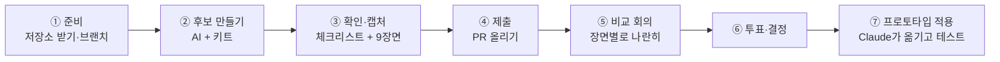

# 🎨 이음 마을 컨셉아트 후보 정하기 — 온보딩 가이드

> **이 문서 하나만 읽으면 시작할 수 있어요.**
> 요청문 원문과 세부 규칙은 [`CONCEPT_BRIEF.md`](CONCEPT_BRIEF.md)에 있어요. 이 문서에서 필요한 순간마다 알려 줄게요.

---

## 1. 한눈에 보기

**무엇을 하나요?**
소셜 월드의 마을 "이음 마을"이 **어떤 그림체·분위기**로 보일지 후보를 여러 개 만들고, 팀이 함께 하나를 골라요.

**왜 하나요?**
소셜 월드는 사회적 고립 위험이 있는 청년이 **부담 없이 들어와 머무는 곳**이에요.
처음 들어온 사람이 긴장하지 않고 "여기 좀 있어도 되겠다"라고 느끼는지는 그림체와 분위기에 크게 달려 있어요.
그래서 한 사람이 정하지 않고, 각자 다른 AI 도구로 다양한 후보를 만들어 비교해요.

**내가 할 일은?**

1. 키트(`village-scene.html`)를 AI 도구에 주고 내 컨셉으로 바꾼다
2. 9개 장면을 캡처한다
3. 저장소에 올린다(PR)
4. 비교 회의에서 투표한다

**걸리는 시간:** 첫 후보 기준 30분~1시간이에요. 색만 바꾸는 가장 쉬운 방식은 20분이면 충분해요.

---

## 2. 전체 흐름



| 단계 | 누가 | 결과물 |
|---|---|---|
| ① 준비 | 각자 | 내 브랜치 `concept/<이름>` |
| ② 후보 만들기 | 각자 | `concept_<이름>_<컨셉>.html` |
| ③ 확인·캡처 | 각자 | 캡처 PNG 9장 |
| ④ 제출 | 각자 | GitHub PR 1개 (후보가 여러 개여도 PR 하나에 모아도 돼요) |
| ⑤ 비교 회의 | 팀 전체 | 장면별 비교 화면 |
| ⑥ 투표·결정 | 팀 전체 | 최종 후보 1개 (+ 섞고 싶은 요소 메모) |
| ⑦ 적용 | 담당자 + Claude | 새 그림체가 들어간 `socialworld-demo.html` |

### 일정 예시 (팀에서 날짜만 정해 주세요)

| 날 | 할 일 |
|---|---|
| 1일차 | 이 문서 읽기 → 가벼운 버전(색·빛만)으로 첫 후보 1개 |
| 2~3일차 | 마음에 들면 깊은 버전(모양까지)이나 2D·2.5D로 확장 |
| 4일차 | 제출 마감 → 비교 회의 → 투표 |
| 5일차 | 선정안 프로토타입 적용 |

---

## 3. 시작 전에 알아 두면 좋은 말

| 용어 | 뜻 |
|---|---|
| **키트** | `social_world/concept_kit/village-scene.html`. 로그인 없이 마을만 띄우는 파일이에요. 우리 프로토타입과 같은 3D 엔진을 써요 |
| **9개 장면** | 광장 전경 · 지원센터 · 미션방 · 동아리센터 · 게임방 · 카페·루미 · 공원 · 내 집 · 내 방. 모든 후보를 **같은 각도**로 비교하려고 정해 둔 컷이에요 |
| **THEME** | 키트 맨 위에 있는 색·빛 설정 묶음이에요. 여기만 바꿔도 분위기가 크게 달라져요 |
| **🎨 꾸미기 구역** | 키트 코드 안에서 모양을 바꿔도 되는 부분이에요. 주석으로 표시돼 있어요 |
| **브랜치** | 내 작업 공간이에요. `concept/minsu`처럼 각자 따로 만들어서 서로 방해하지 않아요 |
| **PR (Pull Request)** | "제 작업 확인하고 합쳐 주세요"라는 요청이에요. GitHub 웹에서 만들어요 |

---

## 4. 단계별 따라 하기

> 예시는 이름 `minsu`, 컨셉 "겨울마을"이에요. 내 것으로 바꿔서 쓰면 돼요.
> Windows는 **Git Bash**, Mac은 **터미널**에서 실행해요.

### ① 준비 — 저장소 받기와 내 브랜치 만들기

```bash
# 처음 한 번만
git clone https://github.com/Team-Backpropagation/social-world.git
cd social-world

# 작업을 시작할 때마다
git switch main && git pull
git switch -c concept/minsu
```

그다음 키트 **복사본**을 내 폴더에 만들어요. 원본은 건드리지 않아요.

```bash
mkdir -p social_world/concept_kit/candidates/minsu
cp social_world/concept_kit/village-scene.html social_world/concept_kit/candidates/minsu/concept_minsu_겨울마을.html
```

> **git이 낯설다면?** GitHub 웹에서 `social_world/concept_kit/village-scene.html`을 열고 오른쪽 위 **다운로드** 버튼으로 받아도 돼요.
> 이 경우 ④ 제출은 공유 드라이브에 올리고, 담당자가 대신 저장소에 넣어요.

### ② 후보 만들기 — AI에게 맡기기

먼저 원본 키트를 브라우저로 열어 한 바퀴 둘러봐요. 파일 탐색기에서 더블클릭하면 열려요.
WASD로 걷고, 마우스로 끌면 시점이 돌아가요.

**방식을 하나 골라요.**

| 방식 | 바뀌는 것 | 난이도 | 추천 대상 | 요청문 |
|---|---|---|---|---|
| **가벼운 버전** | 색·빛·하늘 | ★☆☆ | 모두 (첫 후보는 이걸로) | 브리프 **3-1** |
| **깊은 버전** | + 건물·나무·캐릭터 모양 | ★★☆ | 긴 코드를 잘 다루는 AI를 쓰는 사람 | 브리프 **3-2** |
| **2D·2.5D 재구성** | 그림 방식 자체 | ★★★ | 2D 도트·일러스트, 쿼터뷰를 보여 주고 싶은 사람 | 브리프 **3-3** |

**AI에게 주는 것은 세 가지예요.**

1. 요청문 (브리프에서 복사)
2. 복사한 HTML 파일
3. 내 컨셉 — 레퍼런스 이미지, 무드보드, 또는 한두 줄 설명

**좋은 컨셉 설명 예시**

- "해 질 녘 주황빛, 따뜻하고 조용한 시골 마을. 채도는 낮게"
- "겨울 아침, 눈 쌓인 지붕과 파스텔 하늘. 차갑지 않고 포근하게"
- "지브리풍 수채화 느낌, 초록이 많고 부드러운 그림자"

**결과 반영하기**

- **가벼운 버전:** AI가 준 THEME 블록을 복사본의 `var THEME = { ... };` 부분과 **통째로** 바꿔 끼워요.
- **깊은 버전·2D:** AI가 준 파일 전체를 복사본에 덮어써요.

> **화면이 하얗게 나오면?** AI가 파일 중간을 "…"로 생략한 경우가 대부분이에요.
> "파일 끝부분이 잘렸어, 마지막 300줄을 다시 줘"라고 하거나 가벼운 버전으로 돌아가요.
> 도구별 팁은 브리프의 "도구별 팁"을 참고하세요.

### ③ 확인과 캡처

**확인 체크리스트** (하나라도 안 되면 AI에게 고쳐 달라고 해요)

- [ ] 9개 장면 버튼이 모두 동작한다
- [ ] 건물 문 앞까지 걸어갈 수 있다
- [ ] 건물들이 원래 자리에 있다
- [ ] 내 캐릭터와 루미가 배경에 묻히지 않는다
- [ ] 간판과 미션방 "단계별 퀘스트" 게시판 글자가 읽힌다
- [ ] 휴대폰에서도 열린다

**캡처하는 법**

1. 왼쪽 위 이름 칸에 `민수_겨울마을`처럼 **이름_컨셉**을 적어요.
2. 아래 버튼 줄의 화질을 **높음**으로 둬요.
3. 9개 장면 버튼을 하나씩 누르고, 매번 **📸 이 화면 저장**을 눌러요.
   장면 버튼을 누르면 자동으로 기본 각도로 돌아가서, 모두 같은 각도로 찍혀요.
4. 다운로드 폴더에 생긴 캡처를 내 후보 폴더로 옮겨요.

```bash
mv ~/Downloads/민수_겨울마을_*.png social_world/concept_kit/candidates/minsu/
```

> 2D 후보라 캡처 버튼이 없다면 `Win+Shift+S`(Mac `Cmd+Shift+4`)로 찍고, 같은 이름 규칙(`이름_컨셉_장면.png`)을 써요.

### ④ 제출 — PR 올리기

```bash
git add social_world/concept_kit/candidates/minsu
git commit -m "컨셉 후보: 민수 - 겨울마을"
git push -u origin concept/minsu
```

GitHub 저장소 페이지에 뜨는 **Compare & pull request**를 누르고 아래처럼 채워요.

- **base:** `main`
- **제목:** `컨셉 후보: 민수 - 겨울마을`
- **본문:** 아래 템플릿을 복사해서 채워요

```markdown
## 컨셉
한 줄 설명: 해 질 녘 주황빛, 조용한 시골 마을
방식: 가벼운 버전(3-1) / 깊은 버전(3-2) / 2D·2.5D(3-3)
사용한 AI 도구: ChatGPT / Gemini / Claude / 기타

## 대표 컷
(광장 전경, 카페·루미 캡처 2장 끌어다 놓기)

## 체크리스트
- [ ] 9장면 동작  - [ ] 문 앞까지 이동  - [ ] 건물 제자리
- [ ] 캐릭터 잘 보임  - [ ] 글자 읽힘  - [ ] 휴대폰 확인
```

후보 PR은 각자 **자기 폴더에만** 파일을 더하므로, 여러 명이 동시에 올려도 충돌하지 않아요.

---

## 5. 후보를 고르는 방법

### ⑤ 비교 회의 (30~40분)

1. 제출 마감 후 후보 PR을 모두 `main`에 머지해요. 자기 폴더에만 추가하는 거라 안전해요.
2. **장면별로 나란히** 봐요. "광장 전경"만 모든 후보를 한 화면에 놓고, 다음은 "카페·루미"… 이런 식이에요.
   - 한 후보씩 넘겨 보면 앞의 것을 잊어버려요. 같은 장면끼리 보는 게 핵심이에요.
   - 슬라이드나 공유 보드에 캡처를 붙여 두면 편해요.
3. 각 후보 제작자가 1분씩 컨셉을 설명해요.
4. 마음에 드는 후보는 직접 열어서 걸어 보고, 시점도 돌려 봐요.

### ⑥ 투표와 결정

**1차: 평가표 점수** (각자 후보마다 1~5점)

| 기준 | 질문 |
|---|---|
| 편안함 | 처음 온 사람이 긴장하지 않고 머물고 싶은가? |
| 읽기 쉬움 | 건물마다 무엇을 하는 곳인지 한눈에 구분되는가? |
| 캐릭터 존재감 | 루미·주민·내 캐릭터가 배경에 묻히지 않는가? |
| 톤 일관성 | 9개 장면이 한 세계처럼 보이는가? |
| 가벼움 | 휴대폰(화질: 가벼움)에서도 보기 좋은가? |
| 형식 | 3D / 2.5D / 2D — 제작 기간까지 생각했을 때 현실적인가? |

**2차: 상위 2~3개 중 스티커 투표** (1인 2표, 한 후보에 2표 몰아주기 가능)

**동점이거나 의견이 갈리면:** 팀장이 결정해요. 버려지는 후보의 좋은 요소(예: "B안의 하늘색", "C안의 나무 모양")는 **섞을 요소 메모**로 남겨요.

> 2D·2.5D 후보가 뽑히면 화면 그리는 부분(엔진)을 새로 만들어야 해요. 튜토리얼·대화 로직은 그대로 쓸 수 있어요.
> 일정에 영향이 있으니 결정할 때 함께 고려해요.

### ⑦ 프로토타입에 적용

1. 선정된 후보 HTML과 섞을 요소 메모를 Claude(Cowork)에게 주고 **"이 후보를 socialworld-demo.html에 적용해 줘"** 라고 요청해요.
2. Claude가 색·모양을 본 프로토타입 엔진에 옮기고, 튜토리얼·투어·시점 자동 테스트를 돌려 확인해요.
3. 결과를 팀이 한 번 더 걸어 보고 확정해요.

---

## 6. 자주 묻는 질문

**Q. 후보는 몇 개까지 만들어도 돼요?**
제한은 없어요. 비교 회의가 길어지지 않게 **1인당 대표 1~2개 제출**을 권해요. 나머지는 폴더에 두기만 해도 돼요.

**Q. 다른 사람 후보를 고쳐서 새 후보를 만들어도 돼요?**
돼요. 대신 내 폴더에 복사해서 작업하고, PR 본문에 "○○ 후보 기반"이라고 적어 주세요.

**Q. 건물 위치를 옮기고 싶어요.**
이번 단계에서는 옮기지 않아요. 위치는 튜토리얼 동선·충돌·길찾기와 연결돼 있어요. 제안은 PR 본문이나 회의에서 말로 해 주세요.

**Q. 새 건물이나 소품을 추가해도 돼요?**
장식 소품(꽃, 가로등, 깃발 등)은 괜찮아요. 새 건물은 동선에 영향을 주니 회의에서 먼저 이야기해요.

**Q. 외부 이미지나 3D 모델 파일을 써도 돼요?**
이번에는 쓰지 않아요. 파일 하나로 열려야 비교하기 쉬워서, 그림은 코드로 그려요. 저작권 걱정도 줄어들어요.

**Q. 휴대폰에서 한글이 깨져요.**
키트 파일 맨 위에 `<meta charset="utf-8">`이 있는지 확인해요. AI가 파일 앞부분을 바꾸면서 지웠을 수 있어요.

**Q. git 명령이 막혀요.**
- `git pull`에서 충돌이 난다 → 내 폴더 밖 파일을 건드렸는지 확인해요. 모르겠으면 팀 채널에 화면을 캡처해 올려요.
- `push`가 거절된다 → `git pull origin main` 후 다시 `push`해요.

---

## 7. 관련 문서

| 문서 | 내용 |
|---|---|
| [`CONCEPT_BRIEF.md`](CONCEPT_BRIEF.md) | 빠른 시작 명령어, AI 요청문 원문(3-1·3-2·3-3), 바꾸면 안 되는 것, 도구별 팁 |
| [`candidates/README.md`](candidates/README.md) | 후보 폴더 규칙 |
| `../README.md` | 소셜 월드 프로토타입 전체 설명 |
| `docs/planning/소셜월드_게임흐름_NPC_설계.md` | 장소·NPC·튜토리얼 설계 (왜 이 장소가 여기 있는지) |
